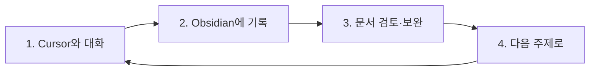
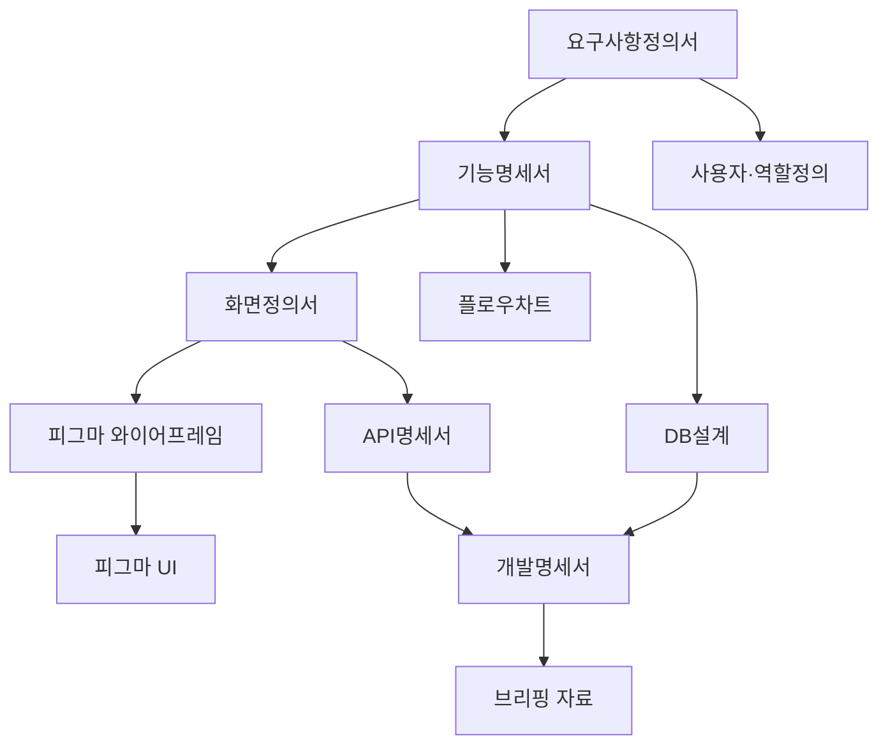

# LifeSpeech 앱 기획 전략

#strategy #planning #briefing #lifespeech

**목표:** Cursor 대화로 기획을 구체화 → Obsidian에 기록 → 브리핑 준비

---

## 1. 워크플로우: 대화 → 문서화 → 검증



### 사이클당 작업

| 단계 | 작업 | 산출물 |
|------|------|--------|
| 1 | "00-대화노트"에 오늘 논의할 주제 적기 | 질문/토픽 리스트 |
| 2 | Cursor에 "@해당문서" 걸고 구체적 질문 | 대화 기록 |
| 3 | Cursor가 제안한 내용 → 명세 문서에 반영 | 업데이트된 .md |
| 4 | 막히는 부분 있으면 즉시 질문 | 명확해진 스펙 |

### 예시 질문 (Cursor에 @로 문서 걸고)

- "[[요구사항정의서]] 기준으로 네이버 예약 연동 시나리오를 써줘"
- "[[기능명세서]] 회원관리 섹션에 출석 상태 정의 추가해줘"
- "[[../../90. Settings/91. Templates/화면정의서]] 출석부 화면에 필요한 필드 전부 나열해줘"

---

## 2. 문서 작성 순서 (의존 관계)



| 순서 | 문서 | 목적 | 완료 시점 |
|------|------|------|-----------|
| 1 | 요구사항정의서 | 미팅 내용 → 체계화된 요구사항 | 1차 기획 확정 |
| 2 | 사용자·역할정의 | 관리자/강사/회원 권한·화면 | 기능 범위 결정 |
| 3 | 기능명세서 | 기능 단위 상세 스펙 | 개발 범위 확정 |
| 4 | 화면정의서 | 화면별 필드·동작 | 피그마 작업 전 |
| 5 | 플로우차트 | 사용자/시스템 흐름 | 화면 간 이동 검증 |
| 6 | API명세서 | 연동·엔드포인트 | 백엔드 설계 |
| 7 | DB설계 | 테이블·관계 | 백엔드 설계 |
| 8 | 개발명세서 | 기술스택·아키텍처 | 개발 착수 전 |
| 9 | 피그마 | 와이어프레임 → UI | 브리핑 시각 자료 |
| 10 | 브리핑 자료 | 요약·슬라이드 | 브리핑 직전 |

---

## 3. 각 문서별 상세 체크리스트

### 3.1 요구사항정의서

- [ ] 미팅 내용에서 기능 요구 추출
- [ ] 비기능 요구 (보안, 성능, 호환성)
- [ ] 우선순위 (P0/P1/P2)
- [ ] 제외 범위 (1차에 하지 않을 것)

### 3.2 사용자·역할정의

- [ ] 역할: 관리자 / 강사 / 회원
- [ ] 역할별 접근 가능 메뉴
- [ ] 역할별 보이는 데이터 범위

### 3.3 기능명세서

- [ ] 기능 ID (F-001, F-002 …)
- [ ] 기능명, 설명, 우선순위
- [ ] 입·출력, 예외 처리
- [ ] 관련 화면 링크

### 3.4 화면정의서

- [ ] 화면 ID (SC-001 …)
- [ ] 화면명, URL, 역할
- [ ] 필드 정의 (이름, 타입, 필수 여부)
- [ ] 버튼·액션 정의
- [ ] 유효성 검사 규칙

### 3.5 플로우차트

- [ ] 회원: 가입 → 수강 → 출석 → 완료
- [ ] 관리자: 예약 확인 → 등록 → 배정 → 출석 관리
- [ ] 강사: 일정 확인 → 체크리스트 작성
- [ ] 예외 플로우 (취소, 환불, 양해 등)

### 3.6 API 명세서

- [ ] 네이버 예약 연동 (방식·주기)
- [ ] 모두싸인 또는 전자계약 연동
- [ ] 문자 발송 API
- [ ] 인증·인가 방식

### 3.7 DB 설계

- [ ] ERD (회원, 수업, 출석, 계약 등)
- [ ] 테이블별 필드·타입
- [ ] 인덱스·제약조건

### 3.8 개발명세서

- [ ] 기술스택 (프론트/백엔드/DB/인프라)
- [ ] 아키텍처 다이어그램
- [ ] 개발 환경·배포 방식
- [ ] 일정·마일스톤

### 3.9 피그마

- [ ] 와이어프레임 (레이아웃·플로우)
- [ ] UI 디자인 (컬러·타이포)
- [ ] 주요 화면 5~10개 이상

### 3.10 브리핑 자료

- [ ] 한 장 요약 (목적·범위·일정)
- [ ] 핵심 화면 3~5장
- [ ] 기술스택·일정 요약
- [ ] 다음 단계 (승인 후 작업)

---

## 4. 폴더 구조 (05-Specs)

```
LifeSpeech/
├── 00-기획전략.md          ← 이 문서
├── 00-대화노트.md          ← 오늘/이번 주 토픽·질문
├── data/                   ← 원본 (미팅, docx 등)
├── 05-Specs/
│   ├── 01-요구사항정의서.md
│   ├── 02-사용자역할정의.md
│   ├── 03-기능명세서.md
│   ├── 04-화면정의서.md
│   ├── 05-플로우차트.md
│   ├── 06-API-명세서.md
│   ├── 07-DB-설계.md
│   ├── 08-개발명세서.md
│   └── 09-브리핑-체크리스트.md
└── 06-Figma/               ← 피그마 링크·스크린샷 (선택)
    └── README.md
```

---

## 5. Cursor 활용 팁

### @로 문서 지정해서 질문

```
@05-Specs/03-기능명세서.md 
출석 상태를 예정/출석/양해/결석 4가지로 정의했는데, 
조율(연기) 케이스는 어떻게 넣을까?
```

### 점진적 구체화

1. **처음:** "미팅 내용 기반으로 요구사항 목록 만들어줘"
2. **다음:** "F-003 출석 관리에 상세 시나리오 추가해줘"
3. **마지막:** "이걸로 API 명세 엔드포인트 작성해줘"

### 문서 간 링크

- `[[03-기능명세서#F-003]]` 로 화면정의서에서 기능 참조
- `[[07-DB-설계#attendances]]` 로 기능명세에서 테이블 참조

---

## 6. 브리핑 D-1 체크

| 항목 | 확인 |
|------|------|
| 요구사항정의서 최종본 | |
| 핵심 화면 5개 이상 | |
| 기능 범위·제외 범위 | |
| 기술스택·일정 | |
| 피그마 링크 (공유 가능) | |
| Q&A 예상 질문 준비 | |

---

*이 문서는 Cursor 대화로 지속 보완하세요. `@00-기획전략` 으로 참조.*
