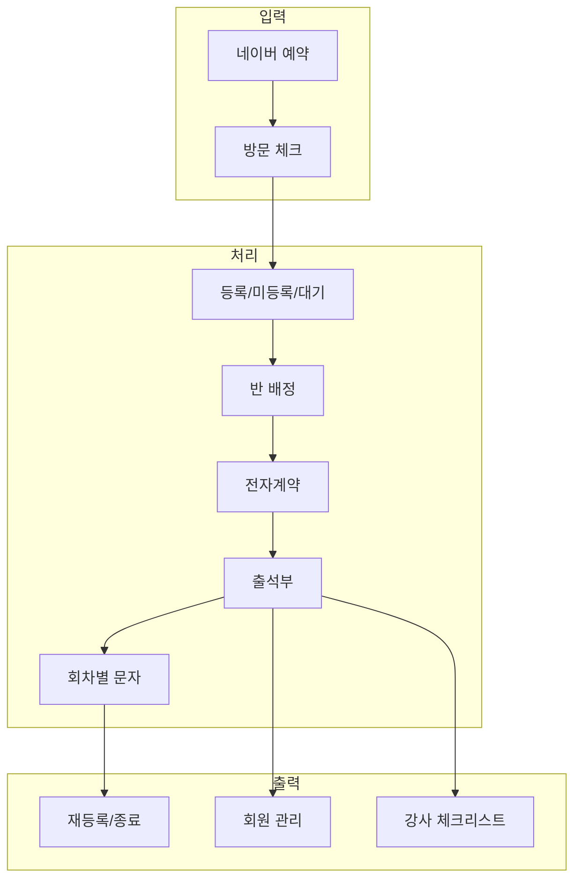
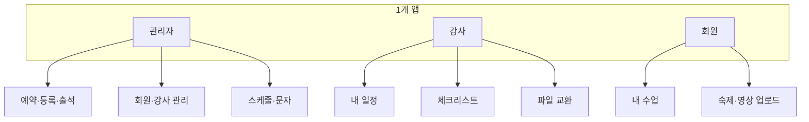
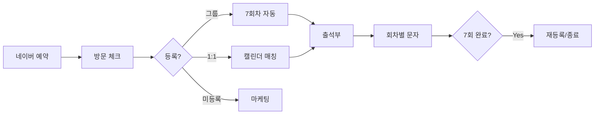
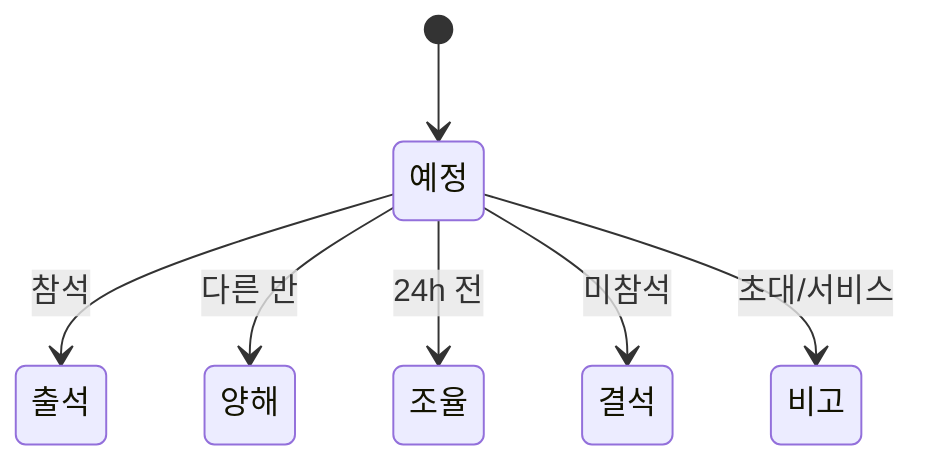
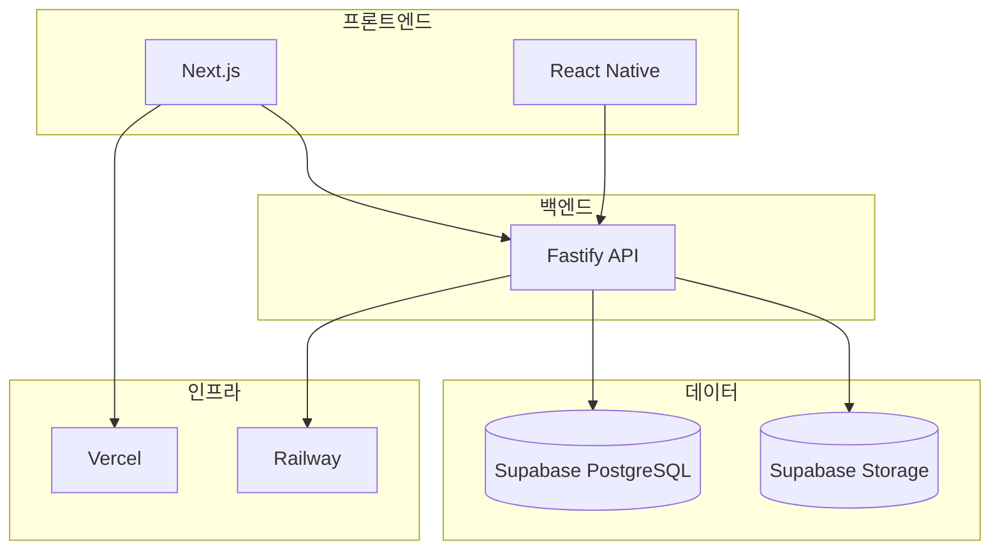
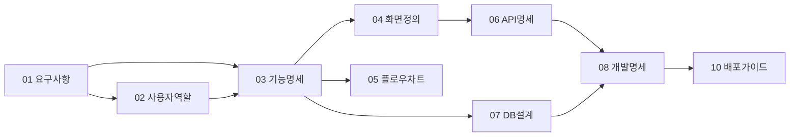
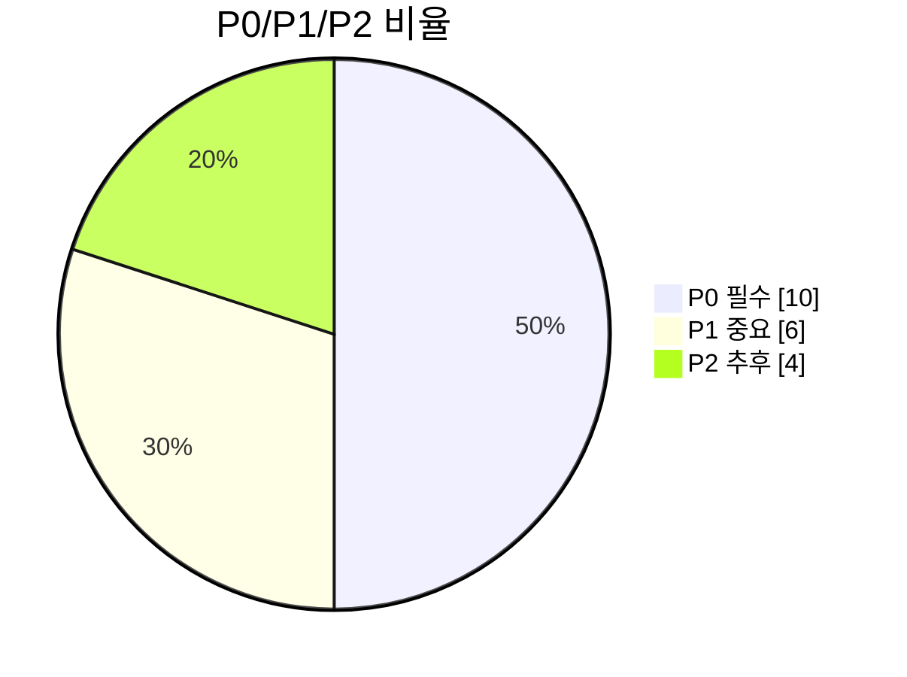
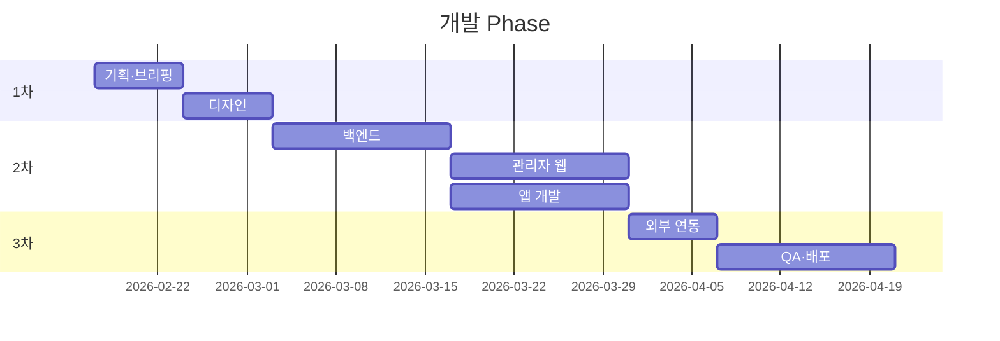

# LifeSpeech 시각화 요약

#visualization #overview #lifespeech

**목적:** 한눈에 보는 그래프·다이어그램 모음. 브리핑 시 참고.

---

## 1. 프로젝트 한눈에

---

## 2. 역할·메뉴 구조

---

## 3. 핵심 플로우 (예약→출석→마감)

---

## 4. 출석 상태 전환

---

## 5. 기술 스택

---

## 6. 문서 연결 구조

---

## 7. 요구사항 우선순위

---

## 8. 개발 일정

---

*각 문서 상세: [[Index]]*
