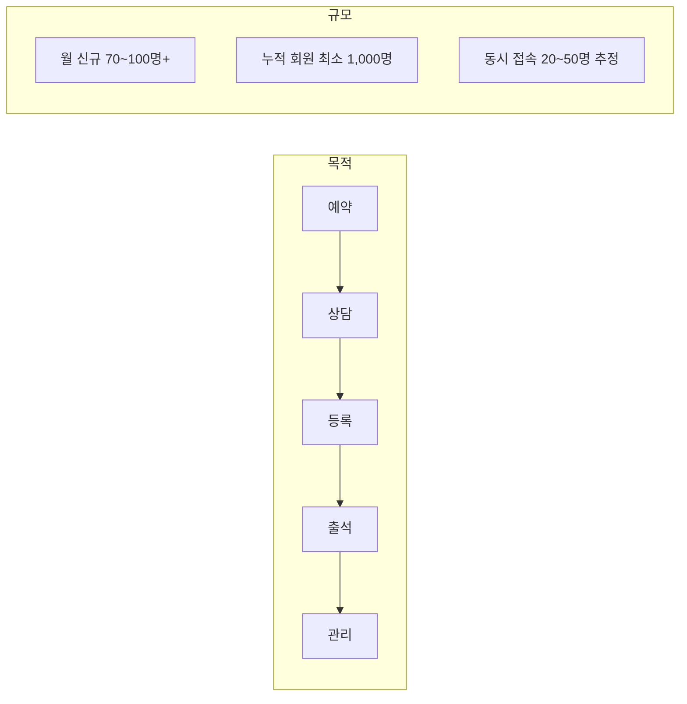
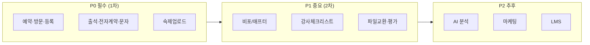

# LifeSpeech 요구사항 정의서

#spec #requirement #lifespeech

**작성일:** 2026-02-11  
**버전:** 1.0  
**상태:** 기획 완료

---

## 1. 프로젝트 개요

| 항목 | 내용 |
|------|------|
| 프로젝트명 | LifeSpeech 스피치 학원 통합 운영 관리 시스템 |
| 발주처 | 라이프 스피치 (Life Speech) |
| 목적 | 예약→상담→등록→출석→관리 전 과정 업무 자동화 |
| 규모 | 월 신규 70~100명+, 누적 회원 **최소 1,000명**, 성장 시 확대 대비 |
| 앱 구성 | **1개 앱**, 역할별(관리자/강사/회원) 화면 분기 |
| 플랫폼 | 관리자: PC 웹 + 모바일 반응형 / 강사·회원: 하이브리드 앱 (iOS, Android) |

---

## 2. 기능 요구사항

### 요구사항 우선순위

### 2.1 P0 (필수, 1차 개발)

| ID    | 요구사항                | 상세                                                       | 출처              |
| ----- | ------------------- | -------------------------------------------------------- | --------------- |
| R-001 | **예약 수집**           | 네이버 예약 데이터 → 앱으로 실시간/주기적 수집. API 미지원 시 수동·CSV            | 운영앱플로우, 미팅      |
| R-002 | **방문 체크**           | 방문자/미방문자 구분. 미방문→리마인드 문자. 방문 시 현장 기입+DB 구축               | 운영앱플로우          |
| R-003 | **등록 상태 관리**        | 등록/미등록/대기 3종 상태. 등록 시 반 배정 → 전자계약 → 출석부 자동 등록            | 미팅 16:22        |
| R-004 | **그룹반 7회차 자동 등록**   | 비기너 등 고정 요일/시간(예: 화 19:30) 기준 7회차 출석부 자동 생성              | 미팅 16:54        |
| R-005 | **1:1 일정 매칭**       | 구글 캘린더 연동. 강사 가능 시간 열기 → 회원이 선택. 회차/일자/강사/목표 입력 (2시간 구성) | 미팅 18:22        |
| R-006 | **전자계약서 발송**        | 모두싸인 등 연동. 등록 시 전화번호로 계약 링크 발송                           | 미팅 19:48        |
| R-007 | **출석부 관리**          | 예정→출석/양해/조율/결석/비고. 회차 등록 시 문자 자동. 마감 시 재등록/종료 이동         | 미팅 21:15, 22:26 |
| R-008 | **회차별 문자 발송**       | 임의 회차 시 문자, 7회차 비포/애프터 안내, 휴무일·설연휴 자동 안내                 | 미팅 20:51        |
| R-009 | **회원 숙제·영상 개별 업로드** | 비공개. 회원→업로드, 강사→확인. 반창 X(개인정보 보호: 유명인 등)                 | 미팅 28:38, 29:17 |
| R-010 | **양도·환불·상담 기입**     | 출석부 또는 회원 상세에서 양도/환불 금액, 수업내용, 강사기입, 상담유무 기록             | 운영앱플로우          |

### 2.2 P1 (중요, 2차)

| ID | 요구사항 | 상세 |
|----|----------|------|
| R-011 | 7회차 비포/애프터 비교 | 6~7회차 전 안내 문자, 영상 비교 요청 |
| R-012 | 강사 체크리스트 | 주차별: 수업구조도, 사진/비포/애프터, 강의주제, 숙제제시·검사, 결석률·재등록률 | 강사평가체크리스트 |
| R-013 | 회원↔강사 파일 교환 | 포트폴리오, 질문안, 대본, 교육영상 등. 관리자/강사 공통 창에서 확인 | 면접강사관리시트 |
| R-014 | 회원 최종 평가 | 호흡공기, 발음, 목구멍말하기, 인상, 제스처, 속도, 완급, 고저, 쇼맨십, 통제 등 점수화 | 운영앱플로우 |
| R-015 | 수업만족도 설문 | 회차 종료 후 만족도 조사 |
| R-016 | 중간진단 상담 관리 | 회원별 중간 진단·상담 기록 |

### 2.3 P2 (추후)

| ID | 요구사항 |
|----|----------|
| R-017 | AI 톤 분석·피드백 |
| R-018 | 3~5분 호흡/톤 연습 영상 (유튜브 비공개 연동) |
| R-019 | 마케팅 퍼널·자동화 |
| R-020 | LMS(라이브클래스) 연동 |

---

## 3. 비기능 요구사항

| 구분 | 내용 |
|------|------|
| **보안** | 회원 정보 비공개(유명인·국회의원 등), 역할별 접근 제어, 개인정보 보유 기간 정책 |
| **성능** | 누적 회원 1,000명+, 월 신규 70~100명+. 동시 접속 20~50명 추정. 페이지네이션·인덱스·인프라 설계 반영 ([[07-DB-설계]], [[06-API-명세서]], [[08-개발명세서]]) |
| **호환** | iOS/Android, 모바일 브라우저 반응형 |
| **인증** | JWT 또는 세션, 비밀번호 복잡도 요구 |
| **암호화** | HTTPS/TLS, 민감정보 암호화 저장 |

---

## 4. 제외 범위 (1차)

- [ ] AI 음성/영상 분석 (P2로 이동)
- [ ] 마케팅 퍼널 상세 시나리오
- [ ] LMS(라이브클래스) 연동
- [ ] 교재 제작·출판 모듈

---

## 5. 참고 자료

| 문서 | 용도 |
|------|------|
| [[../data/converted/수기서류모음/앱개발_상세기획서_클로드]] | 4대 모듈, 메뉴 구조, 기술스택 |
| [[../data/converted/운영앱 플로우20260123]] | 예약→등록→출석 플로우 |
| [[로우데이터 자료/상담_신청지 통합형]] | 상담 신청 필드, 과정 선택, 환불 규정 |
| [[로우데이터 자료/그룹강의_강사_평가_체크리스트]] | 강사용 체크리스트 항목 |
| [[수기서류모음/(필)면접강사_관리시트]] | 1:1 회차별 관리, 비포/애프터, 숙제 |

---

*[[../00-기획전략]] → [[02-사용자역할정의]] → [[03-기능명세서]]*
