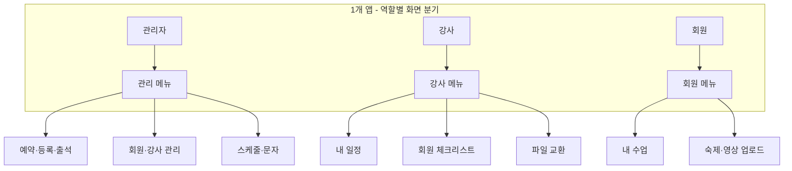
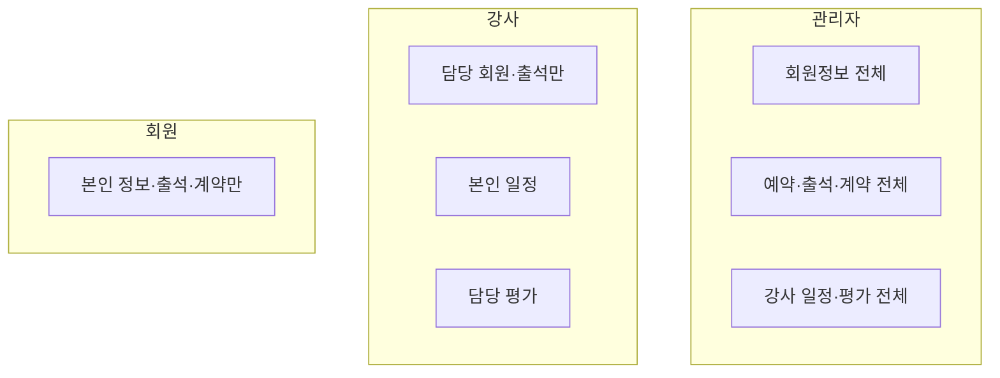

# LifeSpeech 사용자·역할 정의

#spec #role #user #lifespeech

**작성일:** 2026-02-11  
**버전:** 1.0

---

## 1. 역할 개요

| 역할 | 대상 | 접근 플랫폼 | 인원 |
|------|------|--------------|------|
| **관리자** | 실장, 연구원 | PC 웹 + 모바일 반응형 | 2~5명 |
| **강사** | 강사님 | iOS/Android 앱 | 5~10명 |
| **회원** | 수강생 | iOS/Android 앱 | 누적 1,000명+, 월 신규 70~100명+ |

---

## 2. 역할별 메뉴·기능 상세

### 2.1 관리자

| 메뉴 그룹 | 세부 메뉴 | 기능 |
|-----------|-----------|------|
| **A. 고객 관리 (CRM)** | 고객 목록·검색 | 이름, 연락처, 유입경로, 상태 필터 |
| | 고객 상세 | 기본정보, 상담메모, 진단사항, 회차권 |
| | 회차권 관리 | 잔여 회차, 만료일 |
| | 통합 히스토리 | 상담·출석·환불 이력 |
| **B. 예약·결제 (Sales)** | 예약 현황 | 네이버 예약 수집, 방문/미방문, 등록/미등록/대기 |
| | 결제 관리 | 예약금, 완납, 잔금 |
| | 전자계약 관리 | 모두싸인 연동, 링크 발송 |
| | 네이버 예약 연동 | 실시간/주기 수집 |
| **C. 스케줄 (Scheduler)** | 주간 타임테이블 | 그룹반·1:1 통합 |
| | 강사별 스케줄 | 구글 캘린더 연동 |
| | 수강생별 스케줄 | 반·회차·날짜 |
| **D. 출결 (Attendance)** | 출석부 | 반/회차 필터, 예정→출석/양해/조율/결석/비고 |
| | 출석 통계 | 결석률, 재등록률 |
| | 보강 관리 | 24h 전 조율, 양해 처리 |
| **E.출석 후 처리** | 회차 마감 | 재등록 명단/종료 명단 이동 |
| | 양도·환불 | 금액, 사유 기입 |
| **F. 문자** | 회차별 안내 | 자동 템플릿 발송 |
| | 휴무·설연휴 | 일괄 안내 |

### 2.2 강사

| 메뉴 | 기능 |
|------|------|
| 내 일정 | 주간·월간, 구글 캘린더 동기화 |
| 담당 회원 목록 | 담당 회원만 조회 |
| 회차별 체크리스트 | 수업구조도, 비포/애프터, 숙제제시·검사, 개인교감 |
| 파일 교환 | 질문안, 포트폴리오, 대본 수신·업로드 |
| 출석 체크 | 당일 출석 처리 (출석/결석/보강) |

### 2.3 회원

| 메뉴 | 기능 |
|------|------|
| 내 수업 | 수강 과정, 잔여 회차, 다음 일정 |
| 출석 내역 | 회차별 출석 상태 |
| 숙제·영상 업로드 | **개별 비공개** (타 회원 노출 X) |
| 전자계약 | 링크 수신, 서명 |
| 연습 자료 | 3분 호흡 영상 등 (P2) |

---

## 3. 데이터 접근 범위

| 역할 | 회원 정보 | 예약 | 출석 | 계약 | 강사 일정 | 평가·상담 |
|------|------------|------|------|------|-----------|-----------|
| 관리자 | 전체 | 전체 | 전체 | 전체 | 전체 | 전체 |
| 강사 | 담당만 | X | 담당만 | X | 본인 | 담당만 |
| 회원 | 본인만 | 본인 | 본인 | 본인 | X | 본인 |

---

## 4. 권한 정책

| 항목 | 내용 |
|------|------|
| 인증 | 이메일/전화번호 + 비밀번호 |
| 권한 레벨 | 관리자 > 강사 > 회원 |
| 회원 정보 비공개 | 유명인 등 특별 요청 시 마스킹·제한 |
| 강사 표준화 | 체크리스트 기반 계측화, 5점 만점 등 |

---

*[[01-요구사항정의서]] ← → [[03-기능명세서]]*
