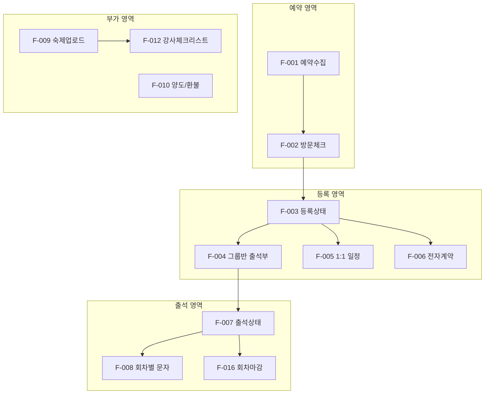

# LifeSpeech 기능명세서

#spec #function #lifespeech

**작성일:** 2026-02-11  
**버전:** 1.0

---

## 1. 기능 목록

### 기능 간 의존 관계

| ID | 기능명 | 역할 | 우선순위 | 관련 화면 |
|----|--------|------|----------|-----------|
| F-001 | 예약 수집 | 관리자 | P0 | SC-001 |
| F-002 | 방문 체크 | 관리자 | P0 | SC-001 |
| F-003 | 등록 상태 관리 | 관리자 | P0 | SC-002, SC-003 |
| F-004 | 그룹반 출석부 자동 등록 | 관리자 | P0 | SC-004 |
| F-005 | 1:1 일정 매칭 | 관리자/강사 | P0 | SC-005 |
| F-006 | 전자계약서 발송 | 관리자 | P0 | SC-003 |
| F-007 | 출석 상태 변경 | 관리자/강사 | P0 | SC-004 |
| F-008 | 회차별 문자 발송 | 관리자 | P0 | 시스템 |
| F-009 | 회원 숙제·영상 업로드 | 회원 | P0 | SC-007 |
| F-010 | 양도·환불·상담 기입 | 관리자 | P0 | SC-003, SC-004 |
| F-011 | 7회차 비포/애프터 안내 | 관리자 | P1 | 시스템 |
| F-012 | 강사 체크리스트 | 강사 | P1 | SC-008 |
| F-013 | 파일 교환 (회원↔강사) | 관리자/강사 | P1 | SC-009 |
| F-014 | 회원 최종 평가 | 강사 | P1 | SC-008 |
| F-015 | 중간진단 상담 | 관리자 | P1 | SC-003 |
| F-016 | 회차 마감 처리 | 관리자 | P0 | SC-004 |

---

## 2. 기능 상세

### F-001 예약 수집

| 항목 | 내용 |
|------|------|
| 설명 | 네이버 예약 데이터를 앱으로 수집 → 예약 목록 반영 |
| 입력 | 네이버 API 응답 또는 수동 입력 (이름, 연락처, 예약일시, 메모) |
| 출력 | 예약자 목록, 중복 방지 |
| 예외 | API 미지원 시: CSV 업로드 또는 수동 등록 |
| 연동 | 네이버 예약 (Webhook/Polling/REST 검토) |

---

### F-002 방문 체크

| 항목 | 내용 |
|------|------|
| 설명 | 예약자 방문 여부 체크. 미방문→리마인드 문자 |
| 입력 | 방문 체크 버튼, 현장 기입 내용(선택), 사진·음성·영상(선택) |
| 출력 | 방문/미방문 상태, DB 구축 |
| 후속 | 방문 시 → 등록 체크로 진행 |

---

### F-003 등록 상태 관리

| 항목 | 내용 |
|------|------|
| 상태 | 대기 / 미등록 / 등록 |
| 액션 | 상태 변경, 등록 시 반 배정 + 전자계약 발송 |
| 입·출력 | 결제 정보(예약금, 완납, 잔금), 과정 선택(그룹/1:1/소장전담) |

---

### F-004 그룹반 출석부 자동 등록

| 항목 | 내용 |
|------|------|
| 입력 | 회원 ID, 반 ID(비기너 화요 등), 시작일 |
| 처리 | 고정 요일/시간(예: 화 19:30) 기준 7회차 생성, 상태=예정 |
| 비고 | 그룹반은 실습 4~8명, 소장특강 시 13명 내외 |

---

### F-005 1:1 일정 매칭

| 항목 | 내용 |
|------|------|
| 입력 | 강사 구글 캘린더, 회원 가능일, 회차(6회 또는 12회 등), 목표 |
| 처리 | 강사 가능 시간 공개 → 회원이 선택. 2시간 구성 |
| 출력 | 강사명, 회원명, 회차, 일자, 목표 |

---

### F-006 전자계약서 발송

| 항목 | 내용 |
|------|------|
| 연동 | 모두싸인 (월 비용) |
| 처리 | 등록 시 전화번호 입력 → 계약서 링크 발송 |
| 템플릿 | 개인코칭, 그룹반 등 과정별 |

---

### F-007 출석 상태 변경

| 상태 | 설명 |
|------|------|
| 예정 | 해당 회차 예정 |
| 출석 | 출석 완료 |
| 양해 | 다른 반 이동 등 사유 있음 (당일 문자 효력 없음) |
| 조율 | 24h 전 연락, 1회 보강 가능 |
| 결석 | 미참석 (당일 결석=회차 차감) |
| 비고 | 초대, 서비스 1회 등 |

**규정:** 24h 전 1회에 한해 보강. 당일 양해 문자 반영 어려움.

---

### F-008 회차별 문자 발송

| 유형 | 내용 |
|------|------|
| 임의 회차 | 회차 등록 시 자동 발송 |
| 6~7회차 | 비포/애프터 영상 비교 안내 |
| 휴무·설연휴 | 일괄 자동 안내 |
| 연동 | 알리고, NHN 등 문자 API |

---

### F-009 회원 숙제·영상 업로드

| 항목 | 내용 |
|------|------|
| 설명 | 회원이 개별 업로드. **비공개** (반창·타 회원 노출 X) |
| 파일 | 영상, 음성, 대본, 기타 교육자료 |
| 확인 | 강사·관리자 확인 여부 |
| 목적 | 비포/애프터 비교, 회원별 성장 추적 |

---

### F-010 양도·환불·상담 기입

| 항목 | 내용 |
|------|------|
| 양도 | 3개월 내 사용, 대체 처리 |
| 환불 | 1회 이상 수업 시 환불 불가. 불가피 시 운영비 10% 공제 |
| 상담 | 상담 유무, 수업 내용, 강사 기입 |

---

### F-012 강사 체크리스트

| 회차별 항목 | 내용 |
|-------------|------|
| 수업 구조도 | ○/× |
| 사진 촬영 | ○/× |
| 비포/애프터 촬영 | ○/× |
| 강의 주제 | 텍스트 |
| 숙제 제시·검사 | ○/× |
| 개인 회원 2명 교감 | ○/× |
| 관리 멤버 초기/마감 회차 | ○/× |
| 결석률, 재등록률 | % |

---

### F-014 회원 최종 평가 (10항목)

호흡공기, 발음, 목구멍말하기, 인상, 제스처, 속도, 완급, 고저, 쇼맨십, 통제 — 강사가 점수화

---

### F-016 회차 마감 처리

| 조건 | 처리 |
|------|------|
| 7회 완료 | 재등록 명단 이동 또는 종료 명단 이동 |
| 종료 시 | 개인 이메일로 영상 자료 자동 송부 (P1) |

---

*[[04-화면정의서]]와 ID 매칭*
