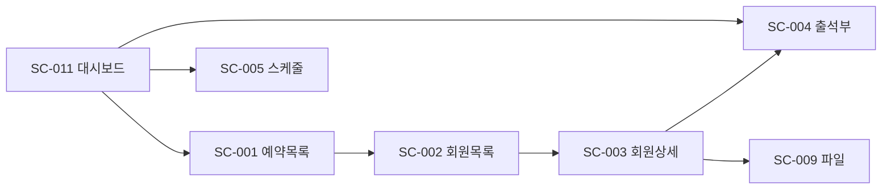
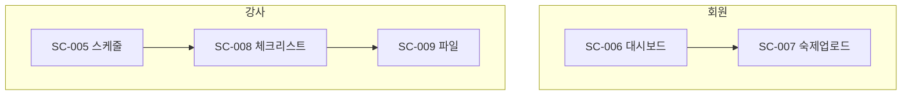

# LifeSpeech 화면정의서

#spec #screen #ui #lifespeech

**작성일:** 2026-02-11  
**버전:** 1.0

---

## 1. 화면 목록

### 화면 흐름도 (관리자)

### 화면 흐름도 (회원·강사)

| ID | 화면명 | 역할 | URL(예) |
|----|--------|------|---------|
| SC-001 | 예약 목록 | 관리자 | /admin/reservations |
| SC-002 | 회원 목록 | 관리자 | /admin/members |
| SC-003 | 회원 상세 | 관리자 | /admin/members/:id |
| SC-004 | 출석부 | 관리자 | /admin/attendance |
| SC-005 | 스케줄 | 관리자/강사 | /schedule |
| SC-006 | 회원 대시보드 | 회원 | /member/dashboard |
| SC-007 | 숙제·영상 업로드 | 회원 | /member/upload |
| SC-008 | 강사 체크리스트 | 강사 | /instructor/checklist |
| SC-009 | 파일 교환 | 관리자/강사 | /files |
| SC-010 | 상담 신청 (입력) | 관리자 | /admin/counseling/new |
| SC-011 | 대시보드 (관리자) | 관리자 | /admin/dashboard |

---

## 2. 관리자 화면 상세

### SC-001 예약 목록

| 항목 | 내용 |
|------|------|
| 목적 | 네이버 예약 수집 데이터 확인, 방문·등록 처리 |
| 메뉴 | A. 고객관리 > 예약 현황 (또는 B. 예약·결제) |

**필드:**

| 필드명 | 타입 | 필수 | 설명 |
|--------|------|------|------|
| 상담일 | date | ○ | 예약 일시 |
| 이름 | text | ○ | |
| 연락처 | text | ○ | |
| 이메일 | text | | |
| 유입경로 | select | | 소개/추천, 플레이스, 블로그, 언론자료 등 |
| 상태 | select | | 방문대기 / 방문완료 / 대기 / 미등록 / 등록 |
| 액션 | button | | 방문체크, 등록하기, 상세 |

**액션:** 방문 체크, 등록 처리, 상세 이동, 필터(날짜, 상태)

---

### SC-002 회원 목록

| 항목 | 내용 |
|------|------|
| 목적 | 등록 회원 검색, 필터, 상태 확인 |
| 메뉴 | A. 고객관리 > 고객 목록 |

**필드:**

| 필드명 | 타입 | 설명 |
|--------|------|------|
| 이름 | text | |
| 연락처 | text | |
| 과정 | select | 그룹반/1:1/소장전담 |
| 반 | text | 비기너 화요, 비기너 토요 등 |
| 상태 | select | 수강중/완료/휴강/환불 |
| 잔여 회차 | number | |
| 액션 | button | 상세 |

**필터:** 과정, 반, 상태, 이름/연락처 검색

---

### SC-003 회원 상세

| 항목 | 내용 |
|------|------|
| 목적 | 회원 기본정보, 상담메모, 진단, 출석, 양도/환불, 계약 |
| 메뉴 | 회원 목록 → 상세 |

**섹션:**

| 섹션 | 필드 |
|------|------|
| 기본정보 | 성명, 연락처, 이메일, 나이대/직업, 유입경로 |
| 상담·진단 | 진단 강사, 상담일, 스피치 필요 이유(면접/PT/관계법 등), 11가지 진단 항목 |
| 과정 | 선택 과정, 예약금, 입금 여부, 확정 여부 |
| 출석 | 회차별 출석 상태 (링크 또는 요약) |
| 양도·환불 | 금액, 사유, 수업내용, 강사기입, 상담유무 |
| 전자계약 | 발송 버튼, 서명 상태 |
| 파일 | 포트폴리오, 질문안, 숙제·영상 목록 |

---

### SC-004 출석부

| 항목 | 내용 |
|------|------|
| 목적 | 반별 회차별 출석 관리, 상태 변경 |
| 메뉴 | D. 출결관리 > 출석부 |

**필드:**

| 필드명 | 타입 | 설명 |
|--------|------|------|
| 반 | text | 비기너 화요, 비기너 토요 등 |
| 회차 | number | 1~7 (그룹) 또는 1~12 (1:1) |
| 날짜 | date | |
| 회원명 | text | |
| 상태 | select | 예정/출석/양해/조율/결석/비고 |
| 비고 | text | 양해 사유, 초대, 서비스 등 |

**액션:** 상태 변경(드롭다운), 필터(반/회차/날짜), 회차 마감(재등록/종료 이동)

---

### SC-005 스케줄

| 항목 | 내용 |
|------|------|
| 목적 | 주간 타임테이블, 강사별 일정, 1:1 매칭 |
| 메뉴 | C. 스케줄 |

**구성:** 주간 뷰, 강사 필터, 반 필터, 1:1 일정 등록 버튼
**연동:** Google Calendar

---

## 3. 강사 화면

### SC-008 강사 체크리스트

| 항목 | 내용 |
|------|------|
| 목적 | 회차별 수업 체크, 평가 입력 |
| 메뉴 | 강사 > 체크리스트 |

**필드 (회차별):** 수업구조도, 사진, 비포/애프터, 강의주제, 숙제제시·검사, 개인교감, 결석률, 재등록률
**평가 (최종):** 호흡공기, 발음, 목구멍말하기, 인상, 제스처, 속도, 완급, 고저, 쇼맨십, 통제 (5점 만점)

---

### SC-009 파일 교환

| 항목 | 내용 |
|------|------|
| 목적 | 회원↔강사 파일 주고받기 |
| 메뉴 | 강사 > 파일 |

**구성:** 회원별 폴더, 포트폴리오/질문안/대본/교육영상 업로드·다운로드

---

## 4. 회원 화면

### SC-006 회원 대시보드

| 항목 | 내용 |
|------|------|
| 목적 | 내 수업 요약, 다음 일정, 잔여 회차 |
| 메뉴 | 회원 > 홈 |

**필드:** 과정명, 반, 잔여 회차, 다음 수업일, 출석 현황 요약

---

### SC-007 숙제·영상 업로드

| 항목 | 내용 |
|------|------|
| 목적 | 회차별 숙제·영상 **개별 비공개** 업로드 |
| 메뉴 | 회원 > 업로드 |

**필드:** 회차 선택, 파일 업로드(영상/음성/문서), 제출일, 강사 확인 여부

---

## 5. 공통·레이아웃

| 영역 | 구성 |
|------|------|
| Header | 로고, 역할 표시, 알림, 로그아웃 |
| Sidebar | 역할별 메뉴 (관리자: A~F, 강사: 일정/체크리스트/파일, 회원: 홈/업로드) |
| Content | 각 화면 본문 |
| Footer | (필요시) |

---

*[[03-기능명세서]]와 ID 매칭. 피그마 작업 전 완성.*
