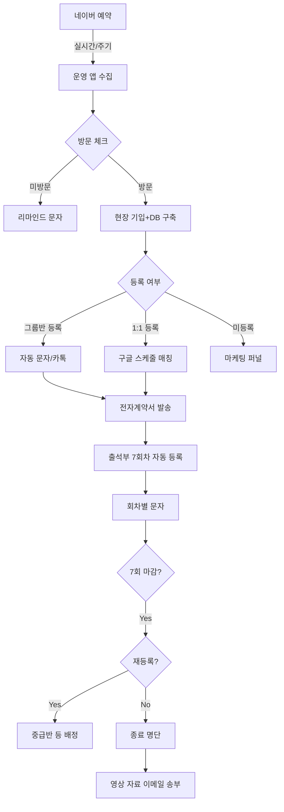
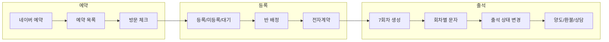
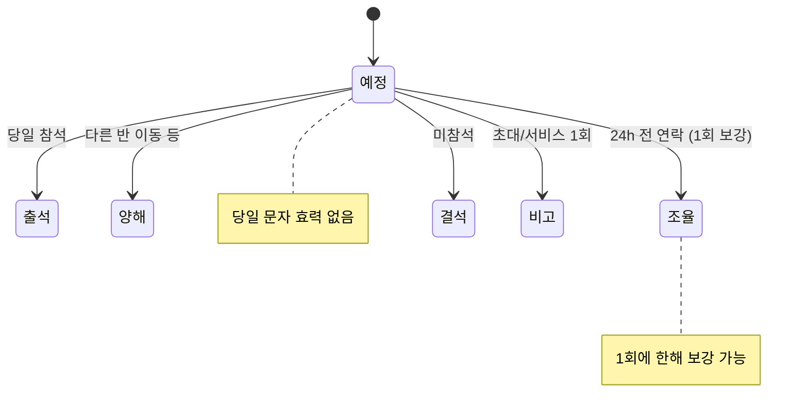
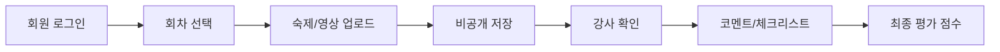
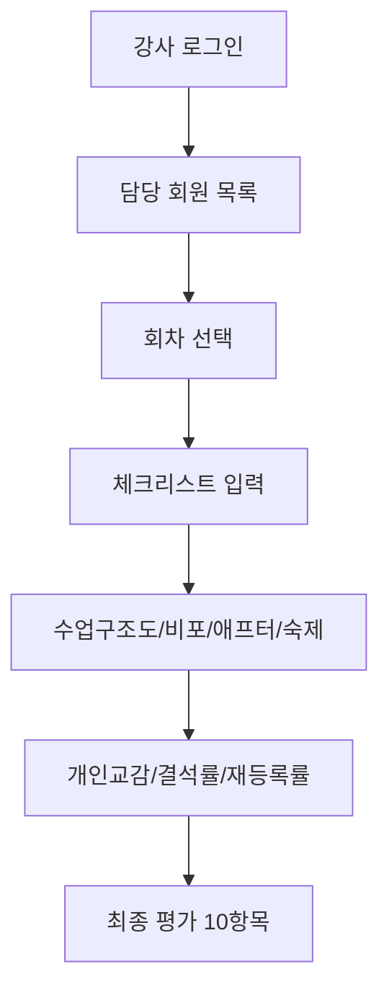
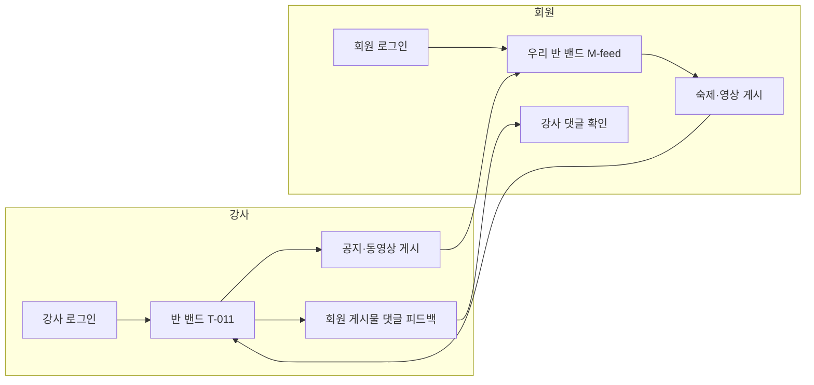
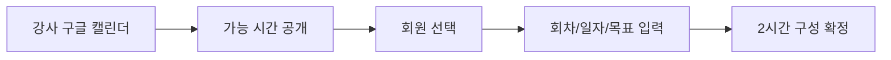

# LifeSpeech 플로우차트

#spec #flow #lifespeech

**작성일:** 2026-02-11  
**버전:** 1.0

---

## 1. 전체 업무 플로우 (운영앱 플로우 기반)

---

## 2. 예약 → 등록 → 출석 상세

---

## 3. 출석 상태 전환

---

## 4. 회원 숙제·영상 업로드 플로우

---

## 5. 강사 체크리스트 플로우

---

## 6. 반 밴드(밴드형) 플로우 — ⚠️ P2 (출시 후 구현)

- **강사**: 반 밴드(홈/게시글/일정/사진첩) → 공지·동영상 게시 → 회원이 올린 숙제·영상 게시물에 댓글(피드백).
- **회원**: 우리 반 밴드(동일 탭 구조) → 숙제·영상 게시 → 강사 댓글(피드백) 확인.

### 6.1 밴드 진입 경로 (설계)

**회원 – 우리 반 밴드(M-feed) 진입**
1. M-001 회원 로그인
2. M-002 회원 홈 진입 (기본 화면)
3. 하단 탭에서 「밴드」 선택 **또는** 홈 카드 「밴드 전체 보기」 클릭
4. M-feed 우리 반 밴드 화면 (홈/게시글/일정/사진첩 탭)

**강사 – 반 밴드(T-011) 진입**
1. T-001 강사 로그인
2. T-002 강사 홈 진입 (기본 화면)
3. 상단 네비에서 「반 밴드」 클릭
4. T-011 반 밴드 화면 (홈/게시글/일정/사진첩 탭)

---

## 7. 1:1 일정 매칭 플로우

---

*[[04-화면정의서]]와 동기화. 반 밴드(T-011, M-feed)는 네이버 밴드 스타일 — P2로 분류, MVP에서 제외. 피그마 와이어프레임 작성 시 참조.*
