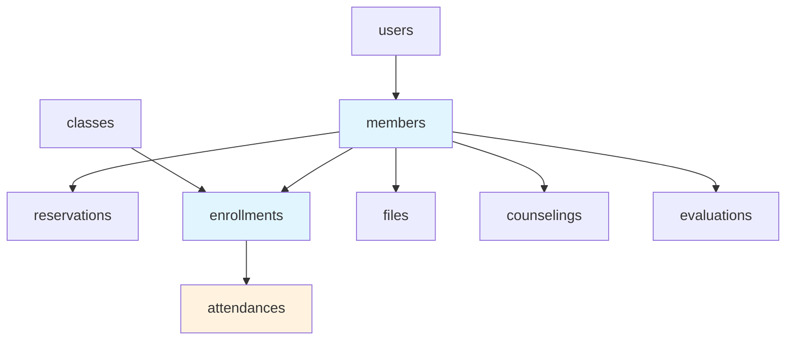
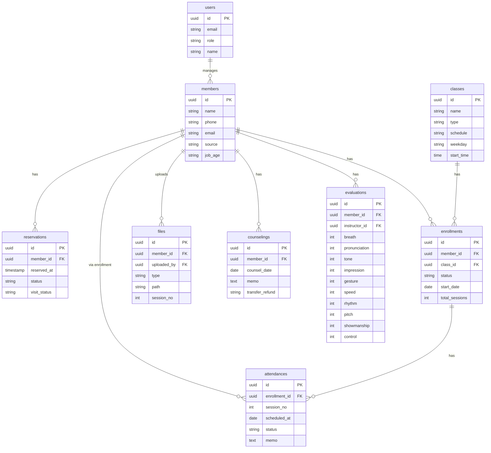

# LifeSpeech DB 설계

#spec #database #lifespeech

**작성일:** 2026-02-11  
**버전:** 1.0

---

## 1. ERD 개요

### 테이블 관계 요약

### ERD 상세

---

## 2. 테이블 정의

### users (관리자·강사)

| 컬럼 | 타입 | Null | PK/FK | 설명 |
|------|------|------|-------|------|
| id | UUID | NO | PK | |
| email | VARCHAR(100) | NO | | |
| password_hash | VARCHAR(255) | NO | | |
| name | VARCHAR(100) | NO | | |
| role | VARCHAR(20) | NO | | admin, instructor |
| created_at | TIMESTAMP | NO | | |
| updated_at | TIMESTAMP | NO | | |

---

### members (회원)

| 컬럼 | 타입 | Null | 설명 |
|------|------|------|------|
| id | UUID | NO | PK |
| name | VARCHAR(100) | NO | |
| phone | VARCHAR(20) | NO | |
| email | VARCHAR(100) | YES | |
| source | VARCHAR(50) | YES | 유입경로 |
| job_age | VARCHAR(50) | YES | 나이대/직업 |
| need_reason | TEXT | YES | 스피치 필요 이유 |
| diagnosis_json | JSONB | YES | 11가지 진단 |
| created_at | TIMESTAMP | NO | |
| updated_at | TIMESTAMP | NO | |

---

### reservations (예약)

| 컬럼 | 타입 | Null | 설명 |
|------|------|------|------|
| id | UUID | NO | PK |
| member_id | UUID | YES | FK (방문 후 연결) |
| source | VARCHAR(20) | NO | naver, manual |
| name | VARCHAR(100) | NO | |
| phone | VARCHAR(20) | NO | |
| reserved_at | TIMESTAMP | NO | |
| status | VARCHAR(20) | NO | pending, visited, waiting, unregistered, registered, cancelled, no_show |
| visit_status | VARCHAR(20) | YES | not_visited, visited |
| memo | TEXT | YES | |
| created_at | TIMESTAMP | NO | |

---

### classes (반)

| 컬럼 | 타입 | Null | 설명 |
|------|------|------|------|
| id | UUID | NO | PK |
| name | VARCHAR(50) | NO | 비기너 화요, 비기너 토요 등 |
| type | VARCHAR(20) | NO | group, 1to1, director |
| schedule | VARCHAR(100) | YES | |
| weekday | VARCHAR(10) | YES | 화, 토 등 |
| start_time | TIME | YES | 19:30 등 |
| max_capacity | INT | YES | 8, 13 등 |

---

### enrollments (수강 등록)

| 컬럼 | 타입 | Null | 설명 |
|------|------|------|------|
| id | UUID | NO | PK |
| member_id | UUID | NO | FK |
| class_id | UUID | NO | FK |
| status | VARCHAR(20) | NO | active, completed, refunded |
| start_date | DATE | NO | |
| total_sessions | INT | NO | group=7, 1to1=6 or 12, director=7 |
| contract_sent_at | TIMESTAMP | YES | |
| contract_signed_at | TIMESTAMP | YES | |

---

### attendances (출석)

| 컬럼 | 타입 | Null | 설명 |
|------|------|------|------|
| id | UUID | NO | PK |
| enrollment_id | UUID | NO | FK |
| session_no | INT | NO | 1~7 or 1~12 |
| scheduled_at | DATE | NO | |
| status | VARCHAR(20) | NO | 예정, 출석, 양해, 조율, 결석, 비고 |
| memo | TEXT | YES | 양해 사유 등 |
| created_at | TIMESTAMP | NO | |
| updated_at | TIMESTAMP | NO | |

---

### files (파일)

| 컬럼 | 타입 | Null | 설명 |
|------|------|------|------|
| id | UUID | NO | PK |
| member_id | UUID | NO | FK |
| enrollment_id | UUID | YES | FK |
| uploaded_by | UUID | YES | FK (member or user) |
| type | VARCHAR(20) | NO | homework, video, portfolio, script |
| path | VARCHAR(500) | NO | 스토리지 경로 |
| session_no | INT | YES | 회차 |
| created_at | TIMESTAMP | NO | |

---

### counselings (상담·양도·환불)

| 컬럼 | 타입 | Null | 설명 |
|------|------|------|------|
| id | UUID | NO | PK |
| member_id | UUID | NO | FK |
| counsel_date | DATE | YES | |
| memo | TEXT | YES | |
| transfer_refund | VARCHAR(50) | YES | 양도/환불 금액, 사유 |
| class_content | TEXT | YES | 수업 내용 |
| instructor_note | TEXT | YES | 강사 기입 |

---

### evaluations (강사 평가)

| 컬럼 | 타입 | Null | 설명 |
|------|------|------|------|
| id | UUID | NO | PK |
| member_id | UUID | NO | FK |
| instructor_id | UUID | NO | FK |
| breath | INT | YES | 호흡공기 1~5 |
| pronunciation | INT | YES | 발음 |
| tone | INT | YES | 목구멍말하기 |
| impression | INT | YES | 인상 |
| gesture | INT | YES | 제스처 |
| speed | INT | YES | 속도 |
| rhythm | INT | YES | 완급 |
| pitch | INT | YES | 고저 |
| showmanship | INT | YES | 쇼맨십 |
| control | INT | YES | 통제 |

---

## 3. 인덱스

| 테이블 | 컬럼 | 용도 |
|--------|------|------|
| reservations | reserved_at, status | 목록 조회 |
| members | phone, name | 검색 |
| members | created_at | 목록 정렬 (1,000명+ 대비) |
| attendances | enrollment_id, session_no | 출석부 조회 |
| attendances | (enrollment_id, scheduled_at) | 반별·날짜 필터 (복합) |
| enrollments | member_id, status | 회원별 수강 조회 |
| enrollments | class_id, status | 반별 회원 조회 |
| files | member_id, created_at | 회원별 파일 목록 |

---

## 4. 규모 대응 (1,000명+ 안전 설계)

| 구분 | 설계 원칙 | 비고 |
|------|-----------|------|
| **회원 목록** | 페이지네이션 필수 (기본 20~50건/페이지) | 1,000명 한 번에 조회 금지 |
| **예약·출석 목록** | 페이지네이션 + 날짜/상태 필터 | 월 100건×12 = 1,200+/년 |
| **attendances** | 회원×회차×년도 → 수만 행 가능 | 인덱스, 필터 필수 |
| **files** | 회원당 영상 다수 → 5,000+ 파일 | Storage 용량 모니터링 |
| **쿼리** | N+1 방지, JOIN 최소화 | 필요한 컬럼만 SELECT |
| **연결 풀** | Supabase 기본 풀 사용 | 동시 20~50 연결 수용 |

### 예상 데이터량 (1년 운영)

| 테이블 | 예상 행 수 |
|--------|------------|
| members | 1,000+ (기존) + 1,000 (신규) = 2,000+ |
| enrollments | 2,000+ |
| attendances | 2,000×7 = 14,000+ (그룹) + 1:1 |
| reservations | ~1,200/년 |
| files | 5,000~10,000+ (영상·숙제) |

*Supabase Pro: 수만 행 수준 안정적. Storage 100GB+ 시 플랜 검토*

---

*[[06-API-명세서]]와 연동*
