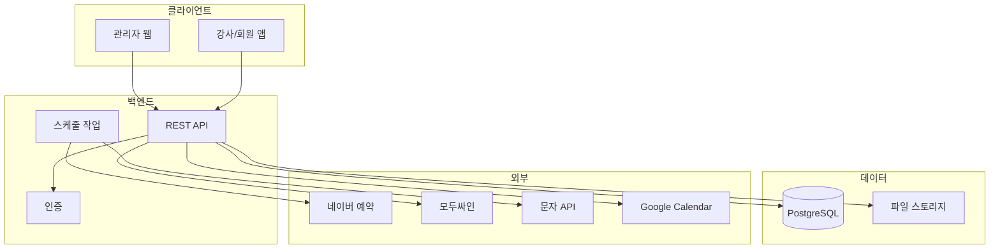
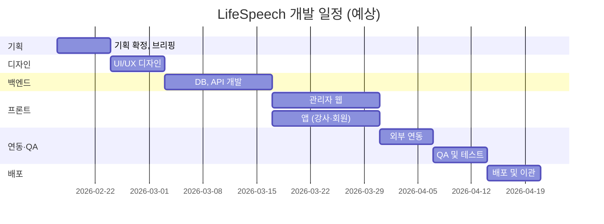
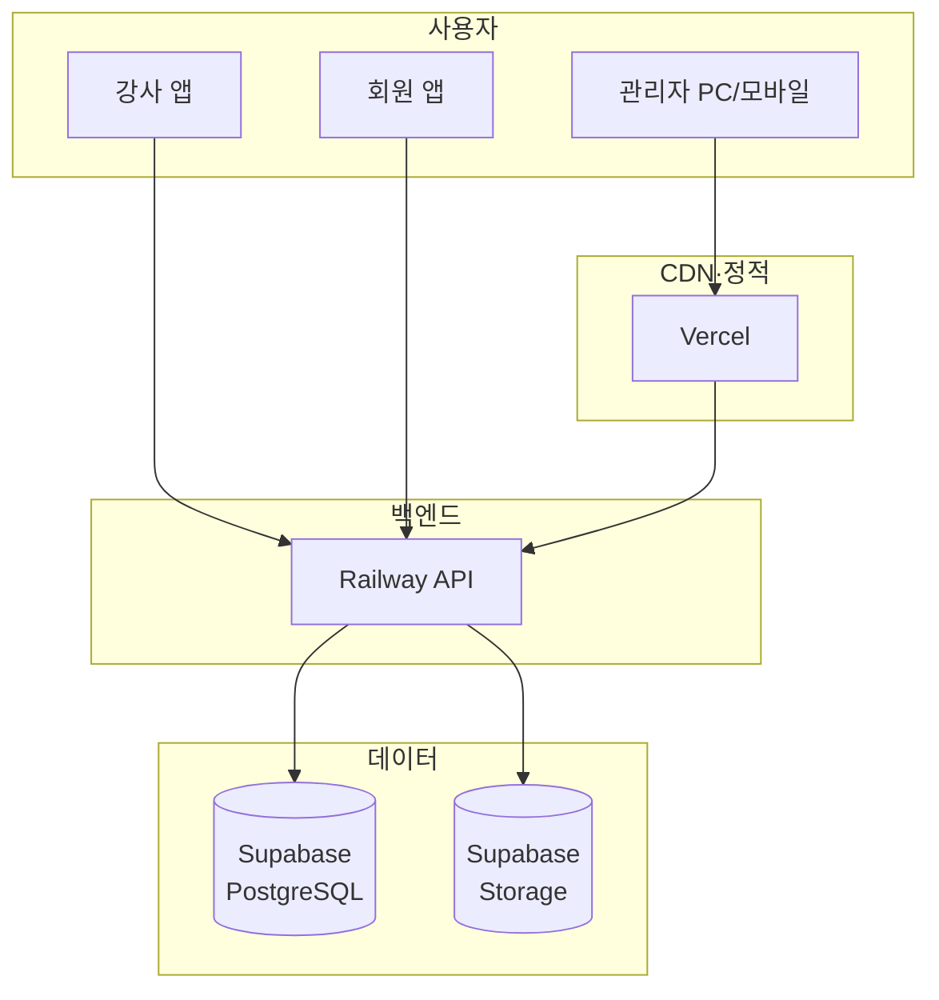
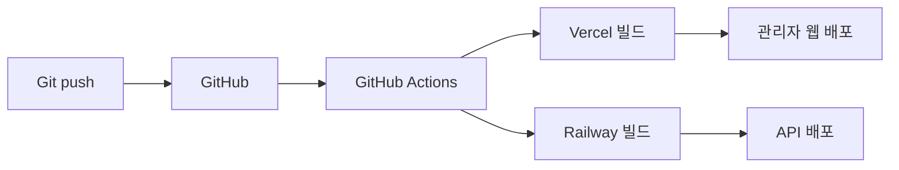

# LifeSpeech 개발명세서

#spec #development #tech #lifespeech

**작성일:** 2026-02-11  
**버전:** 1.0

---

## 1. 프로젝트 개요

| 항목 | 내용 |
|------|------|
| 프로젝트명 | LifeSpeech 스피치 학원 통합 운영 관리 시스템 |
| 목적 | 예약→등록→출석→관리 업무 자동화 |
| 규모 | 누적 회원 1,000명+, 월 신규 70~100명+, 동시 접속 20~50명 추정 |

---

## 2. 기술스택

| 구분 | 기술 | 버전/비고 |
|------|------|-----------|
| **관리자 웹** | Next.js | React 18, App Router, PC + 모바일 반응형 |
| **강사·회원 앱** | React Native | Expo 또는 Bare. iOS, Android |
| **백엔드** | Node.js + Fastify | REST API, TypeScript |
| **DB** | PostgreSQL (Supabase) | 관리형, 자동 백업 |
| **인증** | JWT + Refresh Token | bcrypt 비밀번호 해싱 |
| **파일 스토리지** | Supabase Storage | 숙제·영상·문서 |
| **관리자 호스팅** | Vercel | 자동 빌드·HTTPS |
| **API 호스팅** | Railway | 24/7 가동 |
| **배포** | GitHub Actions | main push 시 CI/CD |
| **API 문서** | Swagger (OpenAPI 3) | - |

**선택 근거:** JS/TS 통일로 유지보수 용이, Supabase·Vercel·Railway로 초기 비용 절감

---

## 3. 아키텍처

---

## 4. 개발 환경

| 항목 | 내용 |
|------|------|
| 버전 관리 | Git, GitHub |
| 이슈 관리 | GitHub Issues 또는 노션 |
| 디자인 | Figma |
| API 문서 | Swagger/OpenAPI |
| 협업 | 슬랙/디스코드 등 |

---

## 5. 개발 일정

### 일정 간트차트

| Phase | 주요 작업 | 기간 | 산출물 |
|-------|------------|------|--------|
| Phase 1 | 기획 확정, 브리핑 | 1주 | 요구사항, 화면정의, 플로우 |
| Phase 2 | UI/UX 디자인 | 1주 | 피그마 와이어프레임, UI |
| Phase 3 | 백엔드 (DB, API) | 2주 | ERD, REST API |
| Phase 4 | 관리자 웹 개발 | 2주 | 예약, 등록, 출석, 회원 |
| Phase 5 | 앱 개발 (강사·회원) | 2주 | 일정, 체크리스트, 업로드 |
| Phase 6 | 외부 연동 | 1주 | 네이버, 문자, 모두싸인, 구글 |
| Phase 7 | QA 및 테스트 | 1주 | 버그 수정 |
| Phase 8 | 배포 및 이관 | 1주 | 운영 환경, 매뉴얼 |

**총 예상:** 약 10~11주 (기획 확정 후)

---

## 6. 배포 및 운영 인프라

*실제 사용 가능한 프로덕션 환경, 지속 운영 목표*

### 6.1 인프라 구성

| 구성 요소 | 서비스 | 용도 | 비고 |
|-----------|--------|------|------|
| **관리자 웹** | Vercel | React/Next.js 배포 | 자동 HTTPS, 글로벌 CDN |
| **API 서버** | Railway 또는 Render | REST API, 스케줄 작업 | 24/7 가동, 동시 20~50 요청 처리 |
| **DB** | Supabase (PostgreSQL) | 회원, 예약, 출석, 파일 메타 | 관리형, 자동 백업, 1,000명+ 충분 |
| **파일 스토리지** | Supabase Storage | 숙제·영상·문서 | 회원별 폴더, 용량·비용 모니터링 |
| **도메인** | 가비아/카페24 등 | admin.lifespeech.kr 등 | SSL 인증서 포함 |
| **앱** | Google Play / App Store | 강사·회원용 | 개발자 계정 필요 |

### 6.2 규모 대응 (1,000명+, 동시 20~50명)

| 구분 | 설계 기준 | 조치 |
|------|-----------|------|
| **동시 접속** | 20~50명 | Railway Hobby·Supabase 기본 연결 풀 수용. 피크 시 로그 모니터링 |
| **회원 1,000+** | DB·API 페이지네이션 | [[07-DB-설계]], [[06-API-명세서]] 참고 |
| **월 신규 70~100** | 예약·등록 트래픽 | 일 평균 ~4건 수준, 부하 미미 |
| **파일(영상)** | 회원당 다수 | Storage Pro 100GB 내, 필요 시 보관 기간·압축 정책 |
| **확장** | 2,000명 이상 시 | Supabase·Railway 플랜 업그레이드, DB 인덱스·쿼리 점검 |

*목표 규모 기준으로 현재 스택은 여유 있음. 모니터링 후 필요 시 스케일업*

### 6.3 도메인 및 URL

| 용도 | URL(예) | 비고 |
|------|---------|------|
| 관리자 웹 | https://admin.lifespeech.kr | 또는 lifespeech.kr/admin |
| API | https://api.lifespeech.kr | CORS 설정 |
| 앱 딥링크 | lifespeech:// | 선택 |

### 6.4 배포 플로우 (CI/CD)

| 단계 | 작업 |
|------|------|
| 1 | main 브랜치 push 시 자동 빌드·배포 |
| 2 | Vercel: 프론트엔드 프로젝트 연결, 환경변수 설정 |
| 3 | Railway: 백엔드 연결, DB_URL 등 시크릿 등록 |
| 4 | 배포 전 테스트: staging 브랜치 또는 프리뷰 URL |

### 6.5 모니터링·백업

| 항목 | 내용 |
|------|------|
| **업타임** | UptimeRobot 또는 Vercel/Railway 내장 (무료) |
| **에러 로그** | Sentry (무료 티어) 또는 Railway 로그 |
| **DB 백업** | Supabase 일일 자동 백업 (Pro 시 7일 보관) |
| **수동 백업** | 월 1회 pg_dump 또는 Supabase 내보내기 |
| **파일 백업** | Storage 용량 정책 (예: 90일 지난 파일 아카이브) |

### 6.6 비용 추정 (월)

| 항목 | 서비스 | 예상 비용 |
|------|--------|-----------|
| 관리자 웹 | Vercel Pro (선택) | 0~2만 원 |
| API | Railway Hobby | 2~5만 원 |
| DB + Storage | Supabase Pro | 2.5~5만 원 |
| 도메인 | .kr 등 | 연 2~3만 원 (월 2천 원 수준) |
| 문자 API | 알리고 등 | 건당 과금 |
| **합계** | | **월 5~12만 원** (앱 스토어 제외) |

### 6.7 앱 스토어 배포

| 스토어 | 계정 | 심사 | 비고 |
|--------|------|------|------|
| Google Play | 개발자 등록 $25 (1회) | 1~3일 | 테스트 트랙 활용 |
| App Store | 개발자 프로그램 $99/년 | 1~7일 | 심사 가이드라인 준수 |

*웹앱(PWA) 또는 Capacitor로 웹 감싸면 스토어 없이도 설치 가능 (내부용 시)*

### 6.8 장애 대응

| 상황 | 대응 |
|------|------|
| API 다운 | Railway/Render 상태 확인, 재시작, 로그 확인 |
| DB 이슈 | Supabase 대시보드, 백업 복구 절차 문서화 |
| 트래픽 급증 | Vercel/Railway 자동 스케일, 필요 시 플랜 업그레이드 |
| 보안 이슈 | JWT·비밀키 로테이션, 의존성 업데이트 정기화 |

### 6.9 운영 체크리스트

- [ ] 도메인 구매 및 DNS 설정
- [ ] Vercel, Railway, Supabase 계정 생성
- [ ] 환경변수(DB, API 키, 문자 등) 등록
- [ ] HTTPS 적용 확인
- [ ] CORS, 보안 헤더 설정
- [ ] 앱 스토어 개발자 계정 (앱 배포 시)
- [ ] 배포·복구 절차 문서화

---

## 7. 산출물

| 구분 | 산출물 |
|------|--------|
| 기획 | 요구사항정의서, 기능명세서, 화면정의서, 플로우차트 |
| 설계 | DB 설계서, API 명세서 |
| 디자인 | Figma 화면 설계 |
| 개발 | 소스코드 (GitHub) |
| 문서 | 관리자 매뉴얼, 사용자 가이드 |
| 운영 | 배포 가이드, 복구 절차, 하자보수 정책 |

---

## 8. 하자보수

| 항목 | 내용 |
|------|------|
| 기간 | 프로젝트 완료 후 12개월 |
| 범위 | 기능 오류, 성능 문제, 보안 이슈 |
| 대응 | 버그 보고 후 N영업일 이내 (협의) |

---

---

**배포 산출물:** [[10-배포-가이드]] — 도메인·인프라·CI/CD·복구 절차·**장기 운영·안정성 체크리스트**

*[[09-브리핑-체크리스트]] 최종 점검*
