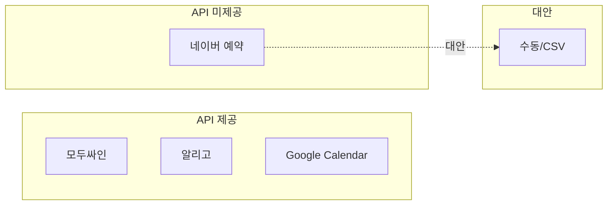

# LifeSpeech 외부 연동 참고 자료

#api #integration #reference #lifespeech

**목적:** 네이버 예약, 모두싸인, 알리고, Google Calendar 등 외부 API 크롤링·정리

**작성일:** 2026-02-11

---

## 1. 네이버 예약 (booking.naver.com)

### 1.1 API 현황

| 항목            | 내용                                                             |
| ------------- | -------------------------------------------------------------- |
| **공식 예약 API** | ❌ **미제공** — 네이버 예약 전용 공개 API 없음                                |
| **결제 API**    | 네이버페이 개발자센터 (developer.pay.naver.com) — 결제예약, 결제승인, 결제취소 등     |
| **문의**        | 네이버 파트너/개발자 문의 또는 [고객센터](https://help.naver.com/service/11712) |

### 1.2 대안 (LifeSpeech 적용)

| 방식           | 설명                                     | 권장    |
| ------------ | -------------------------------------- | ----- |
| **수동 입력**    | 예약자 정보를 앱에서 직접 입력                      | 1차 권장 |
| **CSV 업로드**  | 네이버 예약 매장관리에서 엑셀 내보내기 → CSV 업로드        | 2차 권장 |
| **네이버 문의**   | 파트너사/업체 등록 시 API 제공 여부 직접 문의           | 확인 권장 |
| **브라우저 자동화** | Puppeteer 등으로 관리자 페이지 접근 (약관·제한 확인 필요) | 비권장   |

### 1.3 참고 링크

- [네이버 예약](https://booking.naver.com/)
- [네이버페이 개발자센터](https://developer.pay.naver.com/docs/v1/api)
- [네이버 클라우드 NAVER API](https://api-gov.ncloud-docs.com/docs/common-naverapi-naverapi) — Maps, Clova, Papago 등 (예약과 무관)
[제휴 제안 작성 l NAVER Corp.](https://www.navercorp.com/company/partnerApply)

네이버 공식 제휴 제안 채널 통해 문의하시는 방법이 있을 거예요.  
제휴 구분에서 '스마트플레이스(예약/주문) API 연동' 선택하시고 내용 기재하셔서 검토 요청하시면 됩니다.  
[https://www.navercorp.com/naver/proposalRegister](https://www.navercorp.com/naver/proposalRegister)

---

## 2. 모두싸인 (Modusign) — 전자계약

### 2.1 개요

| 항목 | 내용 |
|------|------|
| **문서** | https://developers.modusign.co.kr/ |
| **인증** | API KEY (설정 → API → API KEY에서 발급) |
| **인코딩** | 요청 본문 **UTF-8 필수** |

### 2.2 주요 API

| 기능 | 설명 | 문서 |
|------|------|------|
| 템플릿으로 서명/열람 요청 | 템플릿 기반 전자계약 시작, 참여자에게 알림 발송 | [템플릿으로 서명요청하기](https://developers.modusign.co.kr/docs/템플릿으로-서명요청하기) |
| 문서정보 조회 | 요청 문서 정보 조회 | [문서 목록 조회하기](https://developers.modusign.co.kr/docs/문서-목록-조회하기) |
| 임베디드 | 임베디드로 서명요청·열람·서명 기능 | [임베디드 서명 요청](https://developers.modusign.co.kr/docs/임베디드-서명-요청) |
| 템플릿 생성/수정 | 템플릿 정보 조회·관리 | [임베디드 템플릿 생성](https://developers.modusign.co.kr/docs/임베디드-템플릿-생성) |

### 2.3 Webhook

- **설정:** 설정 → API → Webhook에서 URL 등록
- **프로토콜:** **HTTPS 필수**, 공개 접근 가능 URL
- **테스트:** ngrok, localtunnel 등 터널링 사용
- **이벤트:** [Webhook event](https://developers.modusign.co.kr/docs/webhook-event) 참고

### 2.4 LifeSpeech 적용

- 계약서 템플릿(개인코칭, 그룹반) 미리 생성
- 등록 시 전화번호로 서명 요청 발송
- Webhook으로 서명 완료 시 DB 상태 업데이트

---

## 3. 알리고 (Aligo) — 문자 발송

### 3.1 개요

| 항목 | 내용 |
|------|------|
| **사이트** | https://smartsms.aligo.in |
| **API 베이스** | https://apis.aligo.in |
| **프로토콜** | HTTPS, POST |

### 3.2 사전 준비

| 순서  | 작업                                                          |
| --- | ----------------------------------------------------------- |
| 1   | 회원가입 및 로그인                                                  |
| 2   | [API KEY 발급](https://smartsms.aligo.in/admin/api/auth.html) |
| 3   | 발송서버 IP 화이트리스트 등록                                           |
| 4   | 발신번호 등록                                                     |
| 5   | 포인트 충전                                                      |

### 3.3 API 엔드포인트

| API | Endpoint | 설명 |
|-----|----------|------|
| 문자보내기 | POST /send/ | 동일 내용 1천 명 동시 전송 |
| 문자보내기(대량) | POST /send_mass/ | 각기 다른 내용 5백 명 동시 전송 |
| 전송내역조회 | POST /list/ | 최근 발송 내역 |
| 전송결과조회 | POST /sms_list/ | 전화번호별 성공/실패 |
| 발송가능건수 | POST /remain/ | 잔여 건수 |
| 예약문자취소 | POST /cancel/ | 발송 5분 전까지 취소 |

### 3.4 문자보내기 필수 파라미터

| 키 | 설명 | 필수 |
|----|------|------|
| key | API Key | O |
| user_id | 사용자 ID | O |
| sender | 발신번호 (사이트에 등록된 번호) | O |
| receiver | 수신번호 (쉼표 구분, 최대 1천 명) | O |
| msg | 메시지 (1~2,000 byte) | O |
| msg_type | SMS / LMS / MMS | X (90byte 초과 시 LMS 자동) |
| testmode_yn | 테스트 시 Y (실제 발송 X) | X |
| rdate, rtime | 예약 발송 | X |

### 3.5 유의사항

- **EUC-KR:** 통신사 기본 인코딩. 특수문자/이모지 시 물음표 등으로 변환될 수 있음
- **Content-Type:** 응답이 `text/html;charset=UTF-8`일 수 있음 — JSON 파싱 전 확인
- **고객명 치환:** `destination=번호|이름,번호|이름`, `msg`에 `%고객명%` 사용

### 3.6 대안

- NHN Cloud (기존 토스트)
- 카카오 비즈니스 (알림톡)
- 쿨SMS 등

---

## 4. Google Calendar API

### 4.1 개요

| 항목 | 내용 |
|------|------|
| **문서** | https://developers.google.com/calendar/api |
| **Node.js** | `npm install googleapis` |
| **인증** | OAuth 2.0, API Key, JWT, Application default credentials |

### 4.2 사전 준비

| 순서 | 작업 |
|------|------|
| 1 | Google Cloud 프로젝트 생성 |
| 2 | Calendar API 활성화 |
| 3 | OAuth 동의 화면 구성 (Internal/External) |
| 4 | 사용자 인증 정보(Client ID/Secret) 생성 |

### 4.3 LifeSpeech 적용

- 강사 구글 캘린더 연동
- 가능 시간 읽기/쓰기
- 1:1 일정 매칭 시 이벤트 생성

---

## 5. 요약

### 연동 현황

| 연동 | API 제공 | 연동 난이도 | 비고 |
|------|-----------|-------------|------|
| 네이버 예약 | ❌ 미제공 | - | 수동/CSV 대안 |
| 모두싸인 | ✅ | 중 | API KEY, Webhook |
| 알리고 | ✅ | 하 | API KEY, 발신번호 등록 |
| Google Calendar | ✅ | 중 | OAuth, 프로젝트 설정 |

---

*[[06-API-명세서]]와 연동. 개발 시 이 문서 참고.*
