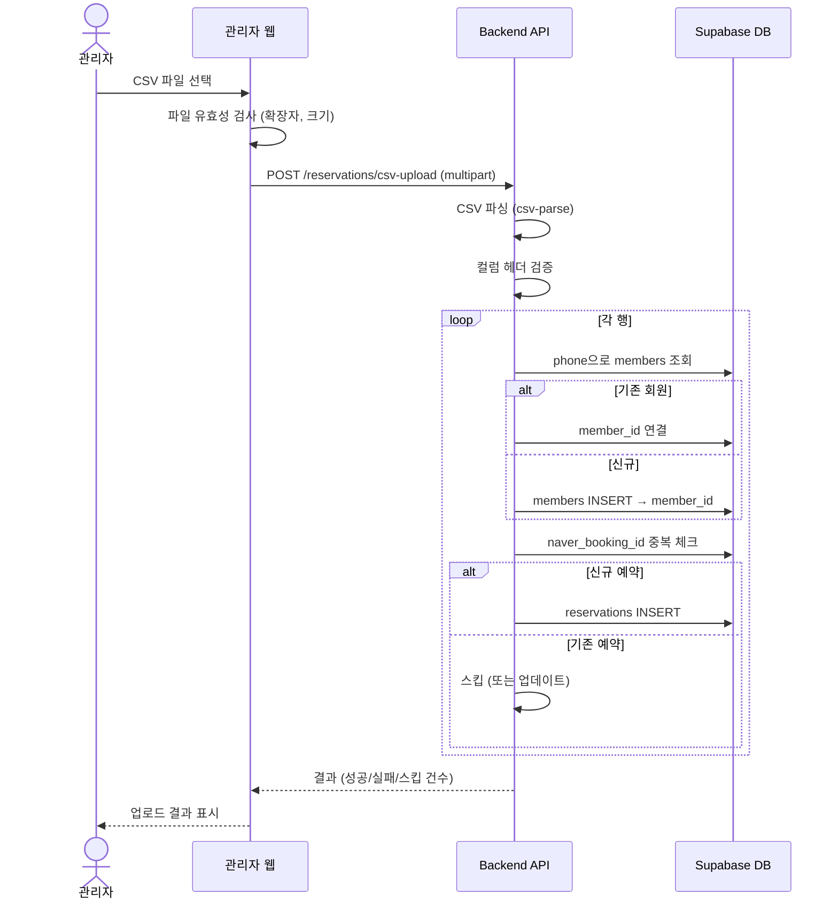

# 네이버 예약 CSV → DB 매핑 가이드

#spec #csv #naver #lifespeech

**작성일:** 2026-02-19
**버전:** 1.0

---

## 1. 개요

네이버 예약 매장관리(booking.naver.com)에서 다운로드한 CSV 파일을 LifeSpeech DB `reservations` + `members` 테이블에 파싱·저장하기 위한 매핑 문서.

### 왜 CSV인가

- 네이버 예약은 **공식 API를 제공하지 않음** ([[11-외부연동-참고자료#1. 네이버 예약]])
- 유일한 데이터 추출 방법: 매장관리 → 예약관리 → 엑셀 내보내기 (CSV)
- 관리자가 주기적으로 CSV를 다운로드 → 웹 관리자 화면에서 업로드

---

## 2. CSV 컬럼 전체 목록 (30개)

네이버 예약 매장관리에서 내보내는 CSV의 전체 컬럼:

| # | CSV 컬럼명 | 예시 값 | 비고 |
|---|-----------|---------|------|
| 1 | 예약번호 | 1234567890 | 네이버 고유 ID |
| 2 | 예약자 | 홍길동 | |
| 3 | 전화번호 | 010-1234-5678 | |
| 4 | 이메일 | hong@email.com | 비어있을 수 있음 |
| 5 | 상품 | 1:1 스피치 컨설팅 | 예약 상품명 |
| 6 | 옵션 | 60분 | 상품 옵션 |
| 7 | 이용일시 | 2026-02-20 14:00 | 예약 날짜+시간 |
| 8 | 인원 | 1 | |
| 9 | 결제상태 | 결제완료 | |
| 10 | 총금액 | 100000 | |
| 11 | 할인금액 | 0 | |
| 12 | 실결제금액 | 100000 | |
| 13 | 결제방법 | 네이버페이 | |
| 14 | 예약상태 | 확정 | 확정/취소/노쇼 등 |
| 15 | 요청사항 | 주차 필요 | |
| 16 | 예약자입력정보1 | 해당하는 것을 선택해주세요: ... | 사전 진단 체크리스트 |
| 17 | 예약자입력정보2 | 스피치가 필요한 이유 | 필요 사유 |
| 18 | 예약자입력정보3 | 어떻게 알고 오셨나요: 네이버 | 유입 경로 |
| 19 | 관리자메모 | 내부 메모 | |
| 20 | 예약신청일시 | 2026-02-18 10:30 | |
| 21 | 예약확정일시 | 2026-02-18 11:00 | |
| 22 | 이용완료일시 | 2026-02-20 15:00 | |
| 23 | 예약취소일시 | | 취소 시에만 |
| 24 | 취소사유 | | 취소 시에만 |
| 25 | 유입경로 | 네이버 예약 | |
| 26 | N페이결제여부 | Y | |
| 27 | 정산상태 | 정산완료 | |
| 28 | 정산예정일 | 2026-02-25 | |
| 29 | 수수료 | 3000 | |
| 30 | 정산금액 | 97000 | |

---

## 3. CSV → DB 매핑

### 3.1 `reservations` 테이블 매핑

| CSV 컬럼 | DB 컬럼 | 타입 | 변환 로직 |
|----------|---------|------|-----------|
| 예약번호 | `naver_booking_id` | VARCHAR(50) | 그대로 저장 (중복 체크 키) |
| 예약자 | `name` | VARCHAR(100) | 그대로 |
| 전화번호 | `phone` | VARCHAR(20) | 하이픈 제거 → `01012345678` |
| 이용일시 | `reserved_at` | TIMESTAMP | `YYYY-MM-DD HH:mm` 파싱 |
| 상품 | `product_name` | VARCHAR(200) | 그대로 |
| 인원 | `party_size` | INT | 숫자 변환 |
| 실결제금액 | `paid_amount` | INT | 숫자 변환 |
| 요청사항 | `memo` | TEXT | 그대로 |
| 예약상태 | `status` | VARCHAR(20) | 매핑 (아래 참고) |
| 예약신청일시 | `created_at` | TIMESTAMP | 파싱 |
| 예약확정일시 | `confirmed_at` | TIMESTAMP | 파싱 (NULL 가능) |
| 이용완료일시 | `completed_at` | TIMESTAMP | 파싱 (NULL 가능) |
| 예약취소일시 | `cancelled_at` | TIMESTAMP | 파싱 (NULL 가능) |
| 취소사유 | `cancel_reason` | TEXT | 그대로 (NULL 가능) |
| - | `source` | VARCHAR(20) | 고정값 `'naver'` |

> **참고:** `naver_booking_id`, `product_name`, `party_size`, `paid_amount`, `confirmed_at`, `completed_at`, `cancelled_at`, `cancel_reason`은 현재 `reservations` 테이블에 없으므로 **마이그레이션 필요** ([[07-DB-설계]] 참고)

### 3.2 `members` 테이블 매핑

| CSV 컬럼 | DB 컬럼 | 변환 로직 |
|----------|---------|-----------|
| 전화번호 | `phone` | 하이픈 제거, **기존 회원 매칭 키** |
| 예약자 | `name` | 신규 회원일 때만 |
| 이메일 | `email` | 신규 회원일 때만 |
| 예약자입력정보1 | `diagnosis_json` | JSON 파싱 (아래 상세) |
| 예약자입력정보2 | `need_reason` | 그대로 |
| 예약자입력정보3 | `source` | 유입 경로 |

### 3.3 저장하지 않는 컬럼 (참고용)

| CSV 컬럼 | 사유 |
|----------|------|
| 옵션 | 상품명에 포함 |
| 결제상태 | 네이버 내부 상태 |
| 총금액 / 할인금액 | 실결제금액만 저장 |
| 결제방법 | 대부분 네이버페이 |
| 관리자메모 | 네이버 관리자 메모 (LifeSpeech 메모와 별개) |
| 유입경로 (25번) | source='naver'로 충분 |
| N페이결제여부 | 참고용 |
| 정산상태 / 정산예정일 / 수수료 / 정산금액 | 회계 영역, 별도 관리 |

---

## 4. 상태 매핑

### 네이버 예약상태 → LifeSpeech status

| 네이버 예약상태 | LifeSpeech `status` | 설명 |
|----------------|---------------------|------|
| 대기 | `pending` | 확정 대기 |
| 확정 | `pending` | 방문 전 (visit_status로 분기) |
| 이용완료 | `visited` | 방문 완료 |
| 취소 | `cancelled` | 취소됨 |
| 노쇼 | `no_show` | 미방문 |

---

## 5. 예약자입력정보 → diagnosis_json 파싱

네이버 예약 시 사전 설문으로 받는 11가지 진단 항목:

### CSV 원본 형태 (예약자입력정보1)

```
해당하는 것을 선택해주세요: 발표/스피치 시 긴장을 많이 합니다, 목소리가 작다는 얘기를 듣습니다
```

### 파싱 → JSON 변환

```json
{
  "tension": true,
  "small_voice": true,
  "fast_speech": false,
  "no_eye_contact": false,
  "monotone": false,
  "filler_words": false,
  "lack_logic": false,
  "no_gesture": false,
  "low_confidence": false,
  "poor_impression": false,
  "other": null
}
```

### 매핑 키워드

| 키워드 (CSV 텍스트 포함 여부) | JSON 키 |
|------------------------------|---------|
| 긴장 | `tension` |
| 목소리가 작 | `small_voice` |
| 빨리 / 속도 | `fast_speech` |
| 시선 / 눈 | `no_eye_contact` |
| 단조 / 억양 | `monotone` |
| 음 / 어 / 습관어 | `filler_words` |
| 논리 / 구성 | `lack_logic` |
| 제스처 / 몸 | `no_gesture` |
| 자신감 / 자존 | `low_confidence` |
| 인상 / 표정 | `poor_impression` |

---

## 6. 업로드 플로우



---

## 7. API 엔드포인트 설계

### `POST /reservations/csv-upload`

#### Request

```
Content-Type: multipart/form-data
Authorization: Bearer {token}
```

| 필드 | 타입 | 필수 | 설명 |
|------|------|------|------|
| file | File | O | CSV 파일 (.csv) |
| mode | string | X | `skip` (기본) / `update` — 중복 예약 처리 |

#### 처리 로직

```typescript
// 1. 파일 검증
if (!file.mimetype.includes('csv') && !file.originalname.endsWith('.csv')) {
  throw new BadRequest('CSV 파일만 업로드 가능합니다')
}
if (file.size > 5 * 1024 * 1024) {
  throw new BadRequest('파일 크기는 5MB 이하여야 합니다')
}

// 2. CSV 파싱
const records = parse(buffer, {
  columns: true,        // 첫 행을 컬럼명으로
  skip_empty_lines: true,
  bom: true,            // BOM 제거 (엑셀 CSV)
  encoding: 'utf-8',
})

// 3. 필수 컬럼 검증
const required = ['예약번호', '예약자', '전화번호', '이용일시']
for (const col of required) {
  if (!(col in records[0])) {
    throw new BadRequest(`필수 컬럼 누락: ${col}`)
  }
}

// 4. 행별 처리
for (const row of records) {
  const phone = row['전화번호'].replace(/-/g, '')

  // 4a. 회원 매칭/생성
  let member = await db.members.findByPhone(phone)
  if (!member) {
    member = await db.members.create({
      name: row['예약자'],
      phone,
      email: row['이메일'] || null,
      source: row['예약자입력정보3'] || 'naver',
      need_reason: row['예약자입력정보2'] || null,
      diagnosis_json: parseDiagnosis(row['예약자입력정보1']),
    })
  }

  // 4b. 중복 체크
  const existing = await db.reservations.findByNaverBookingId(row['예약번호'])
  if (existing) {
    if (mode === 'update') { /* 업데이트 */ }
    else { stats.skipped++; continue }
  }

  // 4c. 예약 생성
  await db.reservations.create({
    member_id: member.id,
    source: 'naver',
    naver_booking_id: row['예약번호'],
    name: row['예약자'],
    phone,
    product_name: row['상품'],
    party_size: parseInt(row['인원']) || 1,
    paid_amount: parseInt(row['실결제금액']) || 0,
    reserved_at: parseDateTime(row['이용일시']),
    status: mapNaverStatus(row['예약상태']),
    memo: row['요청사항'] || null,
    created_at: parseDateTime(row['예약신청일시']),
    confirmed_at: parseDateTime(row['예약확정일시']),
    completed_at: parseDateTime(row['이용완료일시']),
    cancelled_at: parseDateTime(row['예약취소일시']),
    cancel_reason: row['취소사유'] || null,
  })
  stats.created++
}
```

#### Response

```json
{
  "success": true,
  "stats": {
    "total": 50,
    "created": 45,
    "skipped": 3,
    "updated": 0,
    "failed": 2,
    "new_members": 30
  },
  "errors": [
    { "row": 12, "reason": "전화번호 형식 오류: abc" },
    { "row": 37, "reason": "이용일시 파싱 실패" }
  ]
}
```

#### 에러 코드

| HTTP | 사유 |
|------|------|
| 400 | CSV 형식 오류, 필수 컬럼 누락, 파일 크기 초과 |
| 401 | 인증 실패 |
| 403 | admin 역할이 아님 |

---

## 8. DB 마이그레이션 (reservations 테이블 확장)

현재 `reservations` 테이블에 없는 컬럼 추가:

```sql
ALTER TABLE reservations
  ADD COLUMN naver_booking_id VARCHAR(50) UNIQUE,
  ADD COLUMN product_name VARCHAR(200),
  ADD COLUMN party_size INT DEFAULT 1,
  ADD COLUMN paid_amount INT DEFAULT 0,
  ADD COLUMN confirmed_at TIMESTAMP,
  ADD COLUMN completed_at TIMESTAMP,
  ADD COLUMN cancelled_at TIMESTAMP,
  ADD COLUMN cancel_reason TEXT;

-- 중복 방지 인덱스
CREATE UNIQUE INDEX idx_reservations_naver_booking_id
  ON reservations(naver_booking_id)
  WHERE naver_booking_id IS NOT NULL;
```

---

## 9. 프론트엔드 UI 요구사항

### CSV 업로드 화면 (관리자 > 예약관리)

- **위치:** 예약 목록 상단 "CSV 업로드" 버튼
- **드래그&드롭** 또는 파일 선택
- **미리보기:** 파싱 결과 테이블로 표시 (업로드 전 확인)
- **결과 표시:** 성공/스킵/실패 건수 + 실패 행 상세

---

## 10. 주의사항

1. **인코딩:** 엑셀에서 내보낸 CSV는 EUC-KR 또는 UTF-8 BOM일 수 있음. 두 가지 모두 처리
2. **전화번호 정규화:** `010-1234-5678` → `01012345678` (하이픈 제거)
3. **중복 처리:** `naver_booking_id`로 중복 판별. 동일 예약번호는 스킵 (기본) 또는 업데이트 (옵션)
4. **회원 매칭:** 전화번호 기준. 동명이인 주의 — 전화번호가 유일 키
5. **날짜 형식:** `2026-02-20 14:00` 또는 `2026.02.20 14:00` 등 여러 형식 대응
6. **빈 행/값:** CSV에 빈 행이 섞여 있을 수 있음. 예약번호 없는 행은 스킵

---

*[[06-API-명세서]] · [[07-DB-설계]] · [[11-외부연동-참고자료]] 참고*
