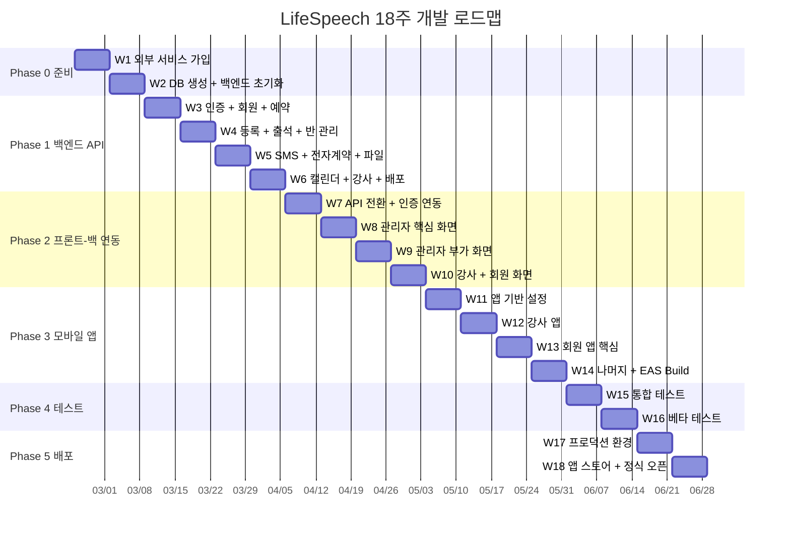
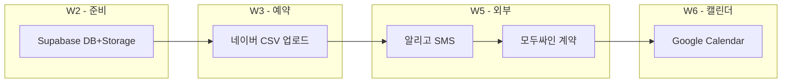

# LifeSpeech 전체 개발 로드맵 (18주)

#spec #roadmap #lifespeech

**작성일:** 2026-02-19
**버전:** 1.0

---

## 1. 개요

라이프 스피치 학원 통합 관리 시스템의 Phase 0 ~ Phase 5 개발 로드맵.
기획 문서 완료 상태에서 프로덕션 배포까지 18주 계획.

### 전체 타임라인

---

## 2. Phase 0: 준비 (W1-W2)

### W1 — 외부 서비스 가입

| 작업               | 상세                                                     | 완료 기준                         |
| ---------------- | ------------------------------------------------------ | ----------------------------- |
| Supabase 프로젝트 생성 | 리전: Northeast Asia (ap-northeast-1)                    | 대시보드 접속 확인                    |
| 알리고 가입           | API KEY 발급, 발신번호 등록                                    | 테스트 문자 발송 성공                  |
| 모두싸인 가입          | API KEY 발급, 테스트 템플릿 생성                                 | API 호출 테스트 성공                 |
| GCP 프로젝트 생성      | Calendar API 활성화, OAuth 클라이언트 생성                       | 33talkwell@gmail.com OAuth 동의 |
| GitHub 저장소       | `lifespeech-api`, `lifespeech-admin`, `lifespeech-app` | 3개 repo 생성                    |

### W2 — DB + 백엔드 초기화

| 작업                | 상세                           | 완료 기준                     |
| ----------------- | ---------------------------- | ------------------------- |
| DB 테이블 9개 생성      | [[07-DB-설계]] 기반 마이그레이션       | Supabase 대시보드에서 전체 테이블 확인 |
| 인덱스 생성            | 8개 인덱스                       | EXPLAIN으로 인덱스 사용 확인       |
| RLS 정책 설정         | 테이블별 Row Level Security      | 권한 없는 접근 차단 확인            |
| Fastify + TS 프로젝트 | TypeScript, ESLint, Prettier | `npm run dev` 성공          |
| Supabase 클라이언트 연결 | `@supabase/supabase-js`      | DB CRUD 테스트 통과            |
| Health 엔드포인트      | `GET /health`                | 200 응답 확인                 |

**Phase 0 검증:** Supabase 테이블 9개 + `GET /health` 200 응답

---

## 3. Phase 1: 백엔드 API (W3-W6)

### W3 — 인증 + 회원 + 예약 CRUD

| 작업 | 엔드포인트 | 상세 |
|------|-----------|------|
| JWT 인증 | `POST /auth/login`, `/logout`, `/me`, `/refresh` | bcrypt + Access/Refresh Token |
| 역할 미들웨어 | - | admin, instructor, member 분기 |
| 회원 CRUD | `GET/POST/PATCH /members` | 페이지네이션, 검색 (이름/전화번호) |
| 예약 CRUD | `GET/POST/PATCH /reservations` | 날짜/상태 필터 |
| CSV 업로드 | `POST /reservations/csv-upload` | [[12-네이버예약-CSV-매핑]] 참고 |
| 예약 상태 변경 | `PATCH /reservations/:id/status` | pending → visited → registered |

### W4 — 등록 + 출석 + 반 관리

| 작업 | 엔드포인트 | 상세 |
|------|-----------|------|
| 반 관리 | `GET/POST/PATCH /classes` | group, 1to1, director |
| 수강 등록 | `POST /enrollments` | 회원+반 매핑 |
| 7회차 자동 생성 | `POST /attendance/bulk-register` | 등록 시 attendances 7행 INSERT |
| 출석 상태 변경 | `PATCH /attendance/:id` | 예정/출석/양해/조율/결석/비고 |
| 회차 마감 | `POST /attendance/close-session` | 재등록 또는 종료 처리 |
| 출석부 조회 | `GET /attendance` | 반별/회차별/날짜별 필터 |

### W5 — SMS + 전자계약 + 파일 업로드

| 작업 | 엔드포인트 | 상세 |
|------|-----------|------|
| 알리고 SMS 연동 | `POST /sms/send` | 단건/대량 발송, 테스트 모드 |
| SMS 템플릿 | `GET /sms/templates` | 예약 확인, 수업 알림 등 |
| 모두싸인 전자계약 | `POST /contracts/send` | 템플릿 기반 서명 요청 |
| Webhook 수신 | `POST /webhooks/modusign` | 서명 완료 → `contract_signed_at` 업데이트 |
| 파일 업로드 | `POST /files/upload` | Supabase Storage, 회원별 폴더 |
| 파일 목록/삭제 | `GET/DELETE /files` | 회원별, 회차별 |

### W6 — Google Calendar + 강사 평가 + 배포

| 작업 | 엔드포인트 | 상세 |
|------|-----------|------|
| Google Calendar 연동 | `GET/POST /schedule/1to1` | 강사 가용시간 읽기, 일정 생성 |
| 주간 스케줄 | `GET /schedule` | 타임테이블 조회 |
| 강사 체크리스트 | `GET/PATCH /checklists` | 회원별 회차별 체크 |
| 평가 | `GET /evaluations/:memberId` | 10항목 1~5점 |
| 상담 기록 | `GET/POST /counselings` | 양도/환불 포함 |
| Railway 배포 | - | `lifespeech-api` 첫 배포 |

**Phase 1 검증:** Postman Collection으로 전체 API 테스트 통과

---

## 4. Phase 2: 프론트-백 연동 (W7-W10)

### W7 — API 클라이언트 전환 + 인증

| 작업 | 상세 |
|------|------|
| API 클라이언트 설정 | axios 인스턴스, 인터셉터, 에러 핸들링 |
| Mock → 실제 API | 기존 Mock 데이터 → API 호출 전환 |
| 로그인/로그아웃 | JWT 저장 (httpOnly cookie 또는 메모리) |
| 토큰 자동 갱신 | Refresh Token 로직 |
| 권한별 라우팅 | admin/instructor/member 분기 |

### W8 — 관리자 핵심 화면

| 화면 | 연동 API | 주요 기능 |
|------|---------|-----------|
| 예약 관리 | `/reservations` | 목록, 필터, CSV 업로드, 상태 변경 |
| 회원 관리 | `/members` | 목록, 검색, 상세, 등록 |
| 수강 등록 | `/enrollments` | 회원→반 배정, 7회차 생성 |
| 출석부 | `/attendance` | 반별 출석 현황, 상태 변경 |

### W9 — 관리자 부가 화면

| 화면 | 연동 API | 주요 기능 |
|------|---------|-----------|
| SMS 발송 | `/sms/send` | 대상 선택, 템플릿, 발송 |
| 전자계약 | `/contracts` | 발송 현황, 서명 상태 |
| 스케줄 | `/schedule` | 주간 타임테이블 |
| 통계 대시보드 | 집계 API | 월별 예약/등록/출석 현황 |

### W10 — 강사 + 회원 웹 화면

| 역할 | 화면 수 | 주요 화면 |
|------|---------|-----------|
| 강사 | 9개 | 출석 체크, 체크리스트, 평가, 스케줄, 상담 메모 등 |
| 회원 | 11개 | 내 수강, 출석 현황, 숙제 업로드, 일정 확인 등 |

**Phase 2 검증:** 관리자 웹에서 예약→등록→출석 전체 플로우 동작

---

## 5. Phase 3: 모바일 앱 (W11-W14)

### W11 — 앱 기반 설정

| 작업 | 상세 |
|------|------|
| Expo 프로젝트 초기화 | `lifespeech-app` |
| API 클라이언트 | 웹과 동일 axios 인스턴스 |
| 인증 (SecureStore) | JWT 저장, 자동 로그인 |
| 공통 컴포넌트 | Header, BottomTab, Card, Modal, Input |
| 네비게이션 | React Navigation, 역할별 탭 분기 |

### W12 — 강사 앱 (5개 화면)

| 화면 | 기능 |
|------|------|
| 오늘의 수업 | 당일 반/회원 목록 |
| 출석 체크 | 상태 변경 (터치) |
| 체크리스트 입력 | 회원별 회차 체크 |
| 스케줄 | 주간 일정 확인 |
| 상담 메모 | 수업 내용/강사 기입 |

### W13 — 회원 앱 핵심 (5개 화면)

| 화면 | 기능 |
|------|------|
| 내 수강 현황 | 반, 진도, 남은 회차 |
| 출석 기록 | 회차별 출결 내역 |
| 숙제 업로드 | 파일/영상 업로드 |
| 내 평가 결과 | 10항목 레이더 차트 |
| 일정 확인 | 다음 수업 일시 |

### W14 — 나머지 화면 + EAS Build

| 작업 | 상세 |
|------|------|
| 나머지 강사 화면 | 평가 입력, 회원 상세 등 |
| 나머지 회원 화면 | 포트폴리오, 계약서 확인, 알림, 설정 등 |
| 푸시 알림 | expo-notifications (선택) |
| EAS Build | iOS + Android 빌드 테스트 |

**Phase 3 검증:** 앱에서 로그인 → 주요 기능 정상 동작

---

## 6. Phase 4: 테스트 (W15-W16)

### W15 — 통합 테스트

| 테스트 | 범위 |
|--------|------|
| E2E 플로우 | 예약 생성 → 방문 체크 → 등록 → 7회차 생성 → 출석 → 마감 |
| CSV 업로드 | 50건 CSV → 회원 자동 생성 → 예약 저장 → 중복 스킵 |
| SMS 발송 | 테스트 모드로 단건/대량 발송 |
| 전자계약 | 서명 요청 → Webhook → 상태 업데이트 |
| API 부하 | k6 또는 Artillery로 동시 50명 시뮬레이션 |
| 보안 | JWT 만료, 권한 없는 접근, SQL Injection, XSS |

### W16 — 베타 테스트

| 참여자 | 인원 | 테스트 항목 |
|--------|------|-------------|
| 관리자 | 2명 | 예약/회원/등록/출석/SMS/계약 전체 |
| 강사 | 3명 | 출석 체크, 체크리스트, 평가, 상담 |
| 회원 | 10명 | 수강 확인, 숙제 업로드, 평가 조회 |

- 피드백 수집: Google Form 또는 노션
- 버그 수정 기간 포함

---

## 7. Phase 5: 배포 (W17-W18)

### W17 — 프로덕션 환경 구축

| 작업 | 상세 |
|------|------|
| 도메인 구매 | `lifespeech.kr` (또는 `.co.kr`) |
| DNS 설정 | `admin.lifespeech.kr` → Vercel, `api.lifespeech.kr` → Railway |
| Supabase Pro 전환 | 자동 백업 7일, 연결 풀 확대 |
| Railway 유료 전환 | 24/7 무중단 |
| 환경변수 정리 | 프로덕션 DB_URL, API_KEY 등 |
| 모니터링 설정 | UptimeRobot + Sentry |
| 기존 데이터 이전 | 엑셀 회원 데이터 → DB 마이그레이션 |

### W18 — 앱 스토어 + 정식 오픈

| 작업 | 상세 |
|------|------|
| Google Play 제출 | 개발자 계정 ($25), 내부 테스트 → 프로덕션 |
| App Store 제출 | 개발자 프로그램 ($99/년), 심사 1~7일 |
| 관리자 매뉴얼 | 주요 기능 사용법 문서 |
| 강사/회원 가이드 | 앱 설치 및 사용법 |
| 정식 오픈 | 관리자 + 강사 + 회원 전환 |

**Phase 5 검증:** 프로덕션 URL 접속 + 앱 스토어 설치 + 전체 플로우 동작

---

## 8. 외부 연동 계정 매핑

| 서비스 | 계정 | 연동 방식 | 구현 시점 |
|--------|------|-----------|-----------|
| **Supabase** | 신규 가입 | DB + Storage + RLS | W2 |
| **알리고** | 신규 가입 (API KEY) | REST API `apis.aligo.in/send/` | W5 |
| **모두싸인** | 신규 가입 (API KEY) | REST API + Webhook | W5 |
| **Google Calendar** | 33talkwell@gmail.com → GCP OAuth | `googleapis` npm | W6 |
| **네이버 예약** | 33talkwell (네이버) | CSV 수동 업로드 (API 없음) | W3 |

### 연동 흐름

---

## 9. 월 운영 비용

### 개발 기간 (무료)

| 항목 | 서비스 | 비용 |
|------|--------|------|
| DB + Storage | Supabase Free | ₩0 |
| API 서버 | Railway Free | ₩0 |
| 관리자 웹 | Vercel Free | ₩0 |
| SMS | 알리고 테스트 모드 | ₩0 |
| 전자계약 | 모두싸인 무료 | ₩0 |
| **합계** | | **₩0** |

### 운영 후 (월)

| 항목 | 서비스 | 예상 비용 |
|------|--------|-----------|
| DB + Storage | Supabase Pro | ~₩35,000 ($25) |
| API 서버 | Railway | ₩7,000~28,000 ($5~20) |
| 관리자 웹 | Vercel Free | ₩0 |
| SMS | 알리고 | ₩20,000~50,000 |
| 전자계약 | 모두싸인 | ₩30,000~50,000 |
| 도메인 | .kr 연간 | ~₩2,000/월 |
| **합계** | | **약 ₩80,000~150,000/월** |

---

## 10. 검증 체크리스트

| Phase | 검증 방법 | 기준 |
|-------|-----------|------|
| Phase 0 | Supabase 테이블 9개 확인 + `GET /health` | 200 응답 |
| Phase 1 | Postman Collection 전체 API 테스트 | 모든 엔드포인트 정상 |
| Phase 2 | 관리자 웹에서 예약→등록→출석 플로우 | 전체 시나리오 통과 |
| Phase 3 | 앱에서 로그인→주요 기능 | iOS/Android 정상 |
| Phase 4 | 통합 테스트 + 베타 (15명) | 크리티컬 버그 0건 |
| Phase 5 | 프로덕션 URL + 앱 스토어 설치 | 실제 운영 가능 |

---

## 11. 리스크 & 대응

| 리스크 | 영향 | 대응 |
|--------|------|------|
| 네이버 예약 CSV 형식 변경 | CSV 파싱 실패 | 컬럼 헤더 동적 매핑, 파싱 에러 로그 |
| 앱 스토어 심사 리젝 | 배포 지연 1~2주 | 심사 가이드라인 사전 검토, 여유 일정 |
| Supabase Free 한계 | DB 500MB 초과 | 이미지/영상은 Storage, 조기 Pro 전환 |
| 알리고 발신번호 심사 | SMS 연동 지연 | W1에서 사전 등록 |
| 강사/회원 앱 적응 | 사용률 저조 | 매뉴얼 + 초기 교육 세션 |

---

## 12. 기술스택 요약

| 구분 | 기술 |
|------|------|
| 관리자 웹 | Next.js (App Router) + TypeScript |
| 모바일 앱 | React Native (Expo) + TypeScript |
| 백엔드 | Node.js + Fastify + TypeScript |
| DB | PostgreSQL (Supabase) |
| 파일 저장 | Supabase Storage |
| 인증 | JWT + Refresh Token |
| 웹 호스팅 | Vercel |
| API 호스팅 | Railway |
| CI/CD | GitHub Actions |

---

*관련 문서: [[07-DB-설계]] · [[06-API-명세서]] · [[08-개발명세서]] · [[12-네이버예약-CSV-매핑]]*
