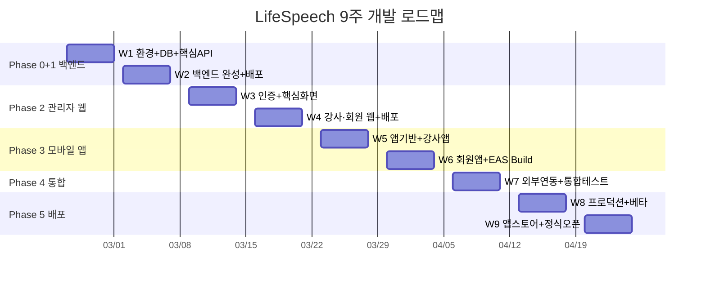

# LifeSpeech 2개월 개발 로드맵 (9주)

#spec #roadmap #lifespeech

**작성일:** 2026-02-19
**버전:** 2.0 (18주 → 9주 압축)
**기간:** 2026-02-24 ~ 2026-04-25

---

## 1. 기존 18주 플랜 대비 변경점

| 항목 | 18주 플랜 | 9주 플랜 |
|------|-----------|----------|
| 총 기간 | 18주 (4.5개월) | 9주 (2개월) |
| 외부 서비스 가입 | W1 전체 | W1 Day1에 몰아서 |
| DB + 백엔드 초기화 | W2 전체 | W1 Day2-3 |
| 백엔드 API | W3-W6 (4주) | W1 Day4 ~ W2 (1.5주) |
| 관리자 웹 | W7-W9 (3주) | W3 (1주) |
| 강사/회원 웹 | W10 (1주) | W4 전반 |
| 모바일 앱 | W11-W14 (4주) | W5-W6 (2주) |
| 외부 연동 (모두싸인, GCal) | W5-W6에 포함 | W7 (별도 주) |
| 테스트 | W15-W16 (2주, 별도) | 매주 금요일 내장 + W7 통합 |
| 프로덕션 배포 | W17-W18 (2주) | W8-W9 (1.5주) |

### 압축 전략

1. **병렬화** — 서비스 가입 + DB 생성 + 백엔드 초기화를 1주에 동시 진행
2. **테스트 내장** — 별도 테스트 주 없이, 매주 금요일을 통합 검증일로 사용
3. **MVP 우선** — P0 기능 먼저, P1(모두싸인·GCal)은 W7에 별도 배치
4. **Claude Code 활용** — 보일러플레이트·CRUD·화면 코드 생성 가속

---

## 2. 전체 타임라인



---

## 3. MVP 범위 정의

### 2개월 내 반드시 완성 (P0)

| # | 기능 | 이유 |
|---|------|------|
| 1 | 네이버 예약 CSV 업로드 | 매일 사용, 수동 입력 대체 |
| 2 | 예약 → 방문 → 등록 파이프라인 | 핵심 비즈니스 플로우 |
| 3 | 수강 등록 + 7회차 자동 생성 | 출석 관리의 전제 |
| 4 | 출석 관리 (6가지 상태) | 매일 사용, 현재 수기 관리 |
| 5 | 회원 CRUD + 검색 | 기본 CRM |
| 6 | 반 관리 (group, 1to1, director) | 수강 등록의 전제 |
| 7 | SMS 발송 (알리고) | 예약 확인, 수업 알림 |
| 8 | 파일 업로드 (숙제/영상) | 강사·회원 모두 사용 |
| 9 | 강사 앱 (출석체크, 체크리스트) | 강사 5~10명 즉시 사용 |
| 10 | 회원 앱 (수강현황, 출석, 숙제) | 회원 1,000+명 사용 |

### W7에 구현 (P1 — 있으면 좋지만 수동 대체 가능)

| # | 기능 | 수동 대체 방법 |
|---|------|---------------|
| 1 | 모두싸인 전자계약 | 직접 모두싸인 사이트에서 발송 |
| 2 | Google Calendar 1:1 스케줄 | 구글 캘린더 직접 관리 |
| 3 | 강사 평가 (10항목) | 엑셀 입력 후 나중에 이전 |

### 출시 후 (P2 — 2개월 이후)

| # | 기능 |
|---|------|
| 1 | 통계 대시보드 고도화 (차트, 월별 추이) |
| 2 | 푸시 알림 (expo-notifications) |
| 3 | AI 음성 분석 |
| 4 | YouTube 연습 영상 |
| 5 | 반 밴드 (커뮤니티 게시판) |
| 6 | 만족도 설문 |

---

## 4. 주차별 상세 계획

---

### W1 (2/24~2/28): 환경 구축 + DB + 핵심 백엔드 API

**목표: 로그인 → 회원 CRUD → 예약 CRUD → CSV 업로드까지 API 동작**

#### Day 1 (월) — 외부 서비스 가입 + GitHub

| 작업               | 구체적 행동                                                                            | 완료 기준                                           |
| ---------------- | --------------------------------------------------------------------------------- | ----------------------------------------------- |
| Supabase 프로젝트 생성 | 리전 `ap-northeast-1`, 프로젝트명 `lifespeech`                                           | 대시보드 접속 + URL/anon key/service key 확보           |
| GitHub 저장소 3개    | `lifespeech-api` (Fastify), `lifespeech-admin` (Next.js), `lifespeech-app` (Expo) | 각 repo에 README + `.gitignore` + 초기 커밋           |
| 알리고 가입           | https://smartsms.aligo.in 가입 → API KEY 발급 → 발신번호 등록 **신청**                        | API KEY 메모 완료. 발신번호 심사는 3~5일 소요 — W2까지 대기       |
| GCP 프로젝트         | console.cloud.google.com → 프로젝트 생성 → Calendar API 활성화 → OAuth 동의 화면 설정            | `33talkwell@gmail.com` OAuth 클라이언트 ID/Secret 확보 |
| 모두싸인 가입          | https://modusign.co.kr 가입 → API KEY 발급                                            | API KEY 메모 완료                                   |

> **소요 시간:** 반나절. 계정 생성은 대기 시간이 있으므로 오전에 시작.

#### Day 2 (화) — DB 테이블 + 인덱스 + RLS

| 작업              | 구체적 행동                                                                                                                                                          | 완료 기준                                                       |
| --------------- | --------------------------------------------------------------------------------------------------------------------------------------------------------------- | ----------------------------------------------------------- |
| 9개 테이블 생성       | [[07-DB-설계]] 기반 SQL 마이그레이션 작성 + Supabase SQL Editor에서 실행                                                                                                        | Supabase 대시보드 → Table Editor에서 9개 테이블 + 전체 컬럼 확인            |
| reservations 확장 | [[12-네이버예약-CSV-매핑]]의 8개 컬럼 추가: `naver_booking_id`, `product_name`, `party_size`, `paid_amount`, `confirmed_at`, `completed_at`, `cancelled_at`, `cancel_reason` | reservations 테이블에 8개 컬럼 존재 확인                               |
| 8개 인덱스 생성       | `members(phone)`, `reservations(status, reserved_date)`, `attendances(enrollment_id, session_number)` 등                                                         | `EXPLAIN ANALYZE SELECT ...` → 인덱스 스캔 확인                    |
| RLS 정책          | 테이블별 `SELECT/INSERT/UPDATE` 정책. 기본: `auth.uid()` 기반 → Fastify에서 service_role key 사용하므로 RLS는 직접 접근 차단용                                                           | anon key로 `supabase.from('users').select('*')` → 빈 배열 또는 에러 |

> **핵심 주의:** reservations에 `cancelled`, `no_show` 상태가 CSV에서 들어옴 → `status` CHECK 제약에 이 값들 포함해야 함 (기존 설계: pending/visited/waiting/unregistered/registered만 있음)

**생성할 파일:**
```
lifespeech-api/
  supabase/
    migrations/
      001_create_tables.sql      ← 9개 테이블 DDL
      002_create_indexes.sql     ← 8개 인덱스
      003_create_rls.sql         ← RLS 정책
      004_reservation_csv_cols.sql ← CSV용 8개 컬럼 추가
```

#### Day 3 (수) — Fastify 프로젝트 초기화

| 작업 | 구체적 행동 | 완료 기준 |
|------|------------|-----------|
| 프로젝트 셋업 | `npm init`, TypeScript, ESLint, Prettier, nodemon | `npm run dev` → `localhost:3000` 실행 |
| 디렉토리 구조 생성 | 아래 구조 참고 | 폴더 + 빈 index.ts 존재 |
| Supabase 클라이언트 | `@supabase/supabase-js` 설치, 환경변수(`SUPABASE_URL`, `SUPABASE_SERVICE_KEY`) | `supabase.from('users').select('*')` → 빈 배열 반환 |
| Health 엔드포인트 | `GET /health` → `{ status: 'ok', timestamp, db: 'connected' }` | `curl localhost:3000/health` → 200 |
| 에러 핸들링 | 글로벌 에러 핸들러, 커스텀 AppError 클래스, 표준 응답 형식 | 존재하지 않는 라우트 → `{ error: 'Not Found', statusCode: 404 }` |

**디렉토리 구조:**
```
lifespeech-api/
  src/
    routes/
      auth.ts
      members.ts
      reservations.ts
      classes.ts
      enrollments.ts
      attendance.ts
      files.ts
      sms.ts
      schedule.ts
      checklists.ts
      evaluations.ts
      counselings.ts
    services/          ← 비즈니스 로직
      auth.service.ts
      member.service.ts
      reservation.service.ts
      ...
    middlewares/
      auth.middleware.ts      ← JWT 검증 + 역할 체크
      error.middleware.ts     ← 글로벌 에러 핸들러
    utils/
      supabase.ts             ← Supabase 클라이언트
      csv-parser.ts           ← CSV 파싱 유틸
      response.ts             ← 표준 응답 포맷
    types/
      index.ts                ← 공통 타입
    app.ts                    ← Fastify 인스턴스 + 플러그인 등록
    server.ts                 ← 서버 시작
  .env.example
  tsconfig.json
  package.json
```

#### Day 4 (목) — JWT 인증 + 역할 미들웨어

| 작업 | 엔드포인트 | 요청/응답 | 완료 기준 |
|------|-----------|-----------|-----------|
| 로그인 | `POST /auth/login` | `{ email, password }` → `{ accessToken, refreshToken, user }` | 올바른 자격증명 → 토큰 쌍 발급 |
| 로그아웃 | `POST /auth/logout` | Header: `Authorization: Bearer {token}` → `{ message: 'logged out' }` | Refresh Token DB에서 삭제/무효화 |
| 내 정보 | `GET /auth/me` | Header: `Authorization: Bearer {token}` → `{ id, email, name, role }` | 유효한 토큰 → 사용자 정보 반환, 만료 토큰 → 401 |
| 토큰 갱신 | `POST /auth/refresh` | `{ refreshToken }` → `{ accessToken, refreshToken }` | 유효한 Refresh Token → 새 토큰 쌍 |
| 역할 미들웨어 | `requireRole('admin')` | 라우트에 적용 → 해당 역할만 통과 | admin이 아닌 사용자 → 403 |

**구현 상세:**
- 비밀번호: `bcrypt` (salt round: 12)
- Access Token: JWT, 만료 15분, payload: `{ userId, role }`
- Refresh Token: JWT, 만료 7일, DB에 저장 (users 테이블에 `refresh_token` 컬럼 또는 별도 테이블)
- 미들웨어 체인: `authenticate` (JWT 검증) → `requireRole` (역할 확인)

**테스트 시나리오:**
```
1. POST /auth/login (올바른 자격증명) → 200 + 토큰
2. POST /auth/login (잘못된 비밀번호) → 401
3. GET /auth/me (유효한 토큰) → 200 + 사용자 정보
4. GET /auth/me (만료된 토큰) → 401
5. GET /auth/me (토큰 없음) → 401
6. POST /auth/refresh (유효한 RT) → 200 + 새 토큰
7. POST /auth/refresh (만료된 RT) → 401
8. GET /members (admin 토큰) → 200
9. GET /members (member 토큰) → 403
```

#### Day 5 (금) — 회원 + 예약 CRUD

| 엔드포인트 | 메서드 | 요청 | 응답 | 권한 |
|-----------|--------|------|------|------|
| `/members` | GET | `?page=1&limit=20&search=홍&status=active` | `{ data: [...], total, page, limit }` | admin |
| `/members` | POST | `{ name, phone, email?, gender?, birth?, ... }` | `{ data: member }` | admin |
| `/members/:id` | GET | - | `{ data: member }` (전체 필드 + 수강이력) | admin, instructor(담당만) |
| `/members/:id` | PATCH | `{ name?, phone?, status?, ... }` | `{ data: member }` | admin |
| `/reservations` | GET | `?page=1&limit=20&status=pending&from=2026-03-01&to=2026-03-31` | `{ data: [...], total, page, limit }` | admin |
| `/reservations` | POST | `{ member_id?, name, phone, reserved_date, product_name?, ... }` | `{ data: reservation }` | admin |
| `/reservations/:id/status` | PATCH | `{ status: 'visited' }` | `{ data: reservation }` | admin |

**검색 로직 (members):**
- `search` 파라미터: 이름 ILIKE 또는 전화번호 LIKE
- `status` 필터: active, inactive, graduated
- 정렬: `sort` (name, created_at), `order` (asc, desc)

**W1 금요일 검증:**
```
✅ Supabase 9개 테이블 + 인덱스 확인
✅ GET /health → 200
✅ POST /auth/login → 토큰 발급
✅ GET /members → 페이지네이션 목록
✅ POST /members → 회원 생성
✅ GET /reservations → 필터링 목록
✅ PATCH /reservations/:id/status → 상태 변경
```

---

### W2 (3/2~3/6): 백엔드 API 완성 + Railway 배포

**목표: 전체 38개 엔드포인트 완성 + Swagger 문서 + Railway 라이브**

#### Day 1 (월) — CSV 업로드 + 반 관리

| 엔드포인트 | 구현 상세 | 완료 기준 |
|-----------|-----------|-----------|
| `POST /reservations/csv-upload` | multipart/form-data, 파일 수신 → 인코딩 감지 (EUC-KR/UTF-8 BOM) → 30컬럼 파싱 → reservations + members upsert | 실제 네이버 CSV 10건 업로드 → DB에 예약+회원 저장 |
| `GET /classes` | `?type=group&page=1` | 반 목록 조회 |
| `POST /classes` | `{ name, type, instructor_id, schedule_day, schedule_time, max_students }` | 반 생성 (group/1to1/director) |
| `PATCH /classes/:id` | `{ name?, instructor_id?, ... }` | 반 정보 수정 |

**CSV 파싱 상세 (csv-parser.ts):**
```
1. 파일 인코딩 감지 (iconv-lite로 EUC-KR → UTF-8 변환)
2. CSV 파싱 (csv-parse 라이브러리)
3. 30컬럼 → reservations 매핑:
   - 예약번호 → naver_booking_id
   - 예약자/연락처 → name, phone (하이픈 제거)
   - 상품명 → product_name
   - 예약일 → reserved_date
   - 상태 → status (확인→pending, 방문→visited, 취소→cancelled 등)
4. 자유텍스트 → diagnosis_json 파싱:
   - "발음" 키워드 → pronunciation: true
   - "떨림" 키워드 → nervousness: true
   - ... (10개 boolean + other)
5. 중복 체크: naver_booking_id 기준 SKIP
6. 전화번호로 기존 회원 매칭 → 없으면 members INSERT
7. 결과 반환: { total, created, skipped, errors: [...] }
```

#### Day 2 (화) — 수강 등록 + 출석 시스템

| 엔드포인트 | 구현 상세 | 완료 기준 |
|-----------|-----------|-----------|
| `POST /enrollments` | `{ member_id, class_id, total_sessions }` → enrollments INSERT + attendances N행 자동 INSERT | 등록 1건 → attendances 7행 확인 |
| `GET /enrollments` | `?member_id=X&class_id=Y` 필터 | 수강 목록 |
| `GET /attendance` | `?class_id=X&session_number=3&date_from=...` | 반별/회차별/날짜별 출석 조회 |
| `PATCH /attendance/:id` | `{ status: '출석', note?: '...' }` | 상태 변경 + 비즈니스 규칙 검증 |
| `POST /attendance/close-session` | `{ enrollment_id }` | 전체 회차 완료 → enrollment status 변경 |

**출석 상태 비즈니스 규칙:**
```
예정 → 출석: 항상 허용
예정 → 양해: 항상 허용 (회차 소진 안 됨)
예정 → 조율: 24시간 전 통보 필요 (시스템은 경고만, 강제 차단 안 함)
          → 보강 1회만 허용 (enrollment 당 makeup_used 카운트)
예정 → 결석: 회차 소진
예정 → 비고: 메모 용도 (회차 소진 안 됨)

마감 로직:
- 전체 회차 중 (출석 + 결석) 합 >= total_sessions → 마감 가능
- 마감 시: enrollment.status = 'completed' 또는 're_enrolled'
```

#### Day 3 (수) — 파일 업로드 + SMS

| 엔드포인트 | 구현 상세 | 완료 기준 |
|-----------|-----------|-----------|
| `POST /files/upload` | multipart → Supabase Storage `members/{member_id}/session_{n}/{filename}` | 파일 업로드 → Storage에서 확인 |
| `GET /files` | `?member_id=X&enrollment_id=Y` | 파일 목록 (URL 포함) |
| `GET /files/:id/download` | Signed URL 생성 (1시간 유효) | 다운로드 URL 반환 |
| `DELETE /files/:id` | Storage + DB 동시 삭제 | 파일 완전 삭제 |
| `POST /sms/send` | `{ recipients: [{phone, name}], message, template_id? }` → 알리고 REST API 호출 | 테스트 모드로 SMS 발송 성공 |
| `GET /sms/templates` | 하드코딩 또는 DB | 템플릿 목록 반환 |

**Supabase Storage 구조:**
```
lifespeech-files/           ← 버킷명
  members/
    {member_id}/
      session_{session_number}/
        homework_20260305.mp4
        script_20260305.pdf
      portfolio/
        before_video.mp4
        after_video.mp4
```

**알리고 SMS 연동:**
```
POST https://apis.aligo.in/send/
Content-Type: application/x-www-form-urlencoded

key={API_KEY}&user_id={USER_ID}&sender={발신번호}
&receiver={수신번호}&msg={메시지내용}
&testmode_yn=Y    ← 개발 중에는 항상 Y
```

#### Day 4 (목) — 스케줄 + 체크리스트 + 평가 + 상담

| 엔드포인트 | 구현 상세 | 완료 기준 |
|-----------|-----------|-----------|
| `GET /schedule` | `?week=2026-W10&instructor_id=X` → 주간 타임테이블 (classes 테이블 기반) | 특정 주의 반 스케줄 반환 |
| `GET /checklists` | `?enrollment_id=X&session_number=3` | 회원별 회차별 체크리스트 |
| `PATCH /checklists/:id` | `{ items: { breath: true, pronunciation: true, ... } }` | 체크 항목 저장 |
| `GET /evaluations/:memberId` | 10항목 점수 조회 | 평가 데이터 반환 |
| `POST /evaluations` | `{ member_id, breath: 4, pronunciation: 3, ... }` | 평가 저장 |
| `GET /counselings` | `?member_id=X` | 상담 기록 목록 |
| `POST /counselings` | `{ member_id, type, content, counselor_id }` | 상담 기록 생성 (양도/환불/일반) |

#### Day 5 (금) — Swagger + Postman + Railway 배포

| 작업 | 구체적 행동 | 완료 기준 |
|------|------------|-----------|
| Swagger 문서 | `@fastify/swagger` + `@fastify/swagger-ui` 설정 → 전체 엔드포인트 자동 문서화 | `/docs` 접속 → 전체 API 목록 + 테스트 가능 |
| Postman Collection | 38개 엔드포인트별 요청 예시 + 테스트 스크립트 | Collection Runner → 전체 통과 |
| Railway 배포 | GitHub 연동 → `main` 브랜치 자동 배포, 환경변수 설정 | `https://{app}.railway.app/health` → 200 |
| 시드 데이터 | 테스트용 관리자 1명, 강사 2명, 회원 5명, 반 2개 | 로그인 → CRUD 정상 |

**W2 금요일 검증 (전체 API 체크리스트):**
```
인증 (4개)
  ✅ login → 토큰 발급
  ✅ logout → 토큰 무효화
  ✅ me → 사용자 정보
  ✅ refresh → 새 토큰

회원 (4개)
  ✅ GET /members → 페이지네이션 + 검색
  ✅ POST /members → 생성
  ✅ GET /members/:id → 상세
  ✅ PATCH /members/:id → 수정

예약 (4개)
  ✅ GET /reservations → 필터
  ✅ POST /reservations → 생성
  ✅ POST /reservations/csv-upload → CSV 파싱
  ✅ PATCH /reservations/:id/status → 상태 변경

반 (3개)
  ✅ GET /classes
  ✅ POST /classes
  ✅ PATCH /classes/:id

등록 (2개)
  ✅ POST /enrollments → 등록 + 출석 자동 생성
  ✅ GET /enrollments

출석 (3개)
  ✅ GET /attendance → 반별/회차별 필터
  ✅ PATCH /attendance/:id → 상태 변경
  ✅ POST /attendance/close-session → 마감

파일 (4개)
  ✅ POST /files/upload
  ✅ GET /files
  ✅ GET /files/:id/download
  ✅ DELETE /files/:id

SMS (2개)
  ✅ POST /sms/send
  ✅ GET /sms/templates

스케줄 (1개)
  ✅ GET /schedule

체크리스트 (2개)
  ✅ GET /checklists
  ✅ PATCH /checklists/:id

평가 (2개)
  ✅ GET /evaluations/:memberId
  ✅ POST /evaluations

상담 (2개)
  ✅ GET /counselings
  ✅ POST /counselings

Railway 배포
  ✅ /health → 200
  ✅ /docs → Swagger UI
```

---

### W3 (3/9~3/13): 관리자 웹 — 인증 + 핵심 화면

**목표: 관리자가 웹에서 예약→방문→등록→출석 전체 플로우를 수행할 수 있음**

#### Day 1 (월) — Next.js 셋업 + 인증 연동

| 작업 | 구체적 행동 | 완료 기준 |
|------|------------|-----------|
| 프로젝트 확인/셋업 | `lifespeech-admin` Next.js App Router + TS 확인 | `npm run dev` → `localhost:3001` |
| API 클라이언트 | `lib/api.ts`: axios 인스턴스, baseURL, 인터셉터 (토큰 첨부, 401→refresh, 에러 toast) | API 호출 → 응답 수신 |
| 인증 컨텍스트 | `contexts/AuthContext.tsx`: login, logout, user 상태, 토큰 메모리 저장 | Context에서 user 접근 가능 |
| 로그인 페이지 | `/login`: 이메일+비밀번호 폼 → 로그인 → `/dashboard` 리디렉트 | 로그인 성공 → 메인 진입 |
| 레이아웃 | 사이드바 (예약/회원/수강/출석/SMS/스케줄/대시보드) + 헤더 (사용자명, 로그아웃) | 사이드바 네비게이션 동작 |
| 라우트 가드 | 미인증 → `/login` 리디렉트, 역할별 메뉴 표시/숨김 | 토큰 없이 `/dashboard` 접근 → 로그인 리디렉트 |

**프론트 디렉토리 구조:**
```
lifespeech-admin/
  src/
    app/
      (auth)/login/page.tsx
      (dashboard)/
        layout.tsx                 ← 사이드바 + 헤더
        dashboard/page.tsx
        reservations/page.tsx
        members/page.tsx
        members/[id]/page.tsx
        enrollments/page.tsx
        attendance/page.tsx
        sms/page.tsx
        schedule/page.tsx
        contracts/page.tsx         ← W7에 구현
      (instructor)/               ← 강사 전용
        instructor/layout.tsx
        instructor/today/page.tsx
        instructor/attendance/page.tsx
        instructor/checklist/page.tsx
        instructor/schedule/page.tsx
        instructor/counseling/page.tsx
      (member)/                    ← 회원 전용
        member/layout.tsx
        member/dashboard/page.tsx
        member/attendance/page.tsx
        member/homework/page.tsx
        member/evaluation/page.tsx
        member/schedule/page.tsx
    components/
      ui/          ← 공통 UI (Button, Input, Select, Table, Modal, Toast, Badge)
      forms/       ← 폼 컴포넌트
      layouts/     ← Sidebar, Header
    lib/
      api.ts       ← axios 인스턴스
      utils.ts     ← 포매팅, 유틸 함수
    contexts/
      AuthContext.tsx
    hooks/
      useMembers.ts, useReservations.ts, ...  ← API 호출 훅
    types/
      index.ts     ← Member, Reservation, Class, ... 타입
```

#### Day 2 (화) — 예약 관리 화면

| 컴포넌트 | 기능 | 완료 기준 |
|----------|------|-----------|
| 예약 목록 테이블 | 컬럼: 예약번호, 이름, 전화번호, 상품명, 상태(Badge), 예약일, 액션 | 데이터 표시 + 정렬 |
| 필터 바 | 날짜 범위 (DatePicker), 상태 (Select), 검색어 (Input) | 필터 적용 → 목록 갱신 |
| 페이지네이션 | 페이지 번호 + 건수 표시 | 페이지 이동 동작 |
| CSV 업로드 | 드래그앤드롭 영역 → 파일 선택 → 업로드 → 결과 모달 (성공 N건, 스킵 N건, 실패 N건) | CSV 업로드 → 목록에 새 예약 표시 |
| 상태 변경 | 행의 상태 Badge 클릭 → 드롭다운 → 변경 확인 | pending→visited 변경 → 즉시 반영 |

#### Day 3 (수) — 회원 관리 화면

| 컴포넌트 | 기능 | 완료 기준 |
|----------|------|-----------|
| 회원 목록 | 이름, 전화번호, 상태(Badge), 등록일 + 실시간 검색 | 이름/전화번호 입력 → 즉시 필터링 |
| 회원 생성 모달 | 이름*, 전화번호*, 이메일, 성별, 생년월일, 메모 | 생성 → 목록에 추가 |
| 회원 상세 페이지 | 탭: 기본정보 / 사전진단 / 수강이력 / 출석현황 / 파일 / 상담 | 탭 전환 → 각 섹션 데이터 로드 |
| 기본정보 수정 | 인라인 수정 폼 → 저장 | 수정 → DB 반영 |
| 사전진단 표시 | `diagnosis_json`의 10개 boolean → 체크/미체크 뱃지 | CSV에서 파싱된 진단 데이터 표시 |

#### Day 4 (목) — 수강 등록 + 출석부

| 컴포넌트 | 기능 | 완료 기준 |
|----------|------|-----------|
| 수강 등록 폼 | 회원 검색/선택 → 반 선택 → 회차 수(6/7/12) → 등록 | 등록 → 7행 출석 자동 생성 확인 |
| 출석부 메인 | 반 선택 탭 → 회원×회차 그리드 (행: 회원, 열: 회차) | 그리드에 출석 상태 표시 |
| 출석 상태 셀 | 셀 클릭 → 드롭다운 (예정/출석/양해/조율/결석/비고) → 색상 코딩 | 상태 변경 → DB 반영 → 색상 즉시 업데이트 |
| 회차 마감 | 마감 버튼 → 확인 모달 → 재등록 or 종료 선택 | 마감 → enrollment 상태 변경 |

**출석 상태 색상:**
```
예정: gray     출석: green    양해: blue
조율: yellow   결석: red      비고: purple
```

#### Day 5 (금) — 관리자 부가 화면 + 통합 검증

| 컴포넌트 | 기능 | 완료 기준 |
|----------|------|-----------|
| SMS 발송 | 수신자 선택 (개별/반별) → 메시지 입력 or 템플릿 → 발송 → 결과 확인 | 테스트 모드 SMS 발송 성공 |
| 스케줄 | 주간 타임테이블: 요일(월~토) × 시간(09~21) 그리드, 반 이름 표시 | 현재 주 스케줄 표시 |
| 대시보드 | 카드: 오늘 예약 N건, 방문 대기 N건, 진행 중 수업 N건, 이번 달 신규 등록 N건 | 실시간 데이터 표시 |

**W3 전체 플로우 검증:**
```
1. 관리자 로그인
2. CSV 업로드 → 예약 10건 생성
3. 예약 목록에서 1건 → "방문" 상태로 변경
4. 해당 회원 상세 → 사전진단 확인
5. 수강 등록 (그룹반, 7회차)
6. 출석부 → 1회차 "출석" 처리
7. SMS 발송 (테스트 모드)
→ 전체 플로우 에러 없이 완료
```

---

### W4 (3/16~3/20): 강사·회원 웹 화면 + Vercel 배포

**목표: 3개 역할 모두 웹에서 핵심 기능 사용 가능 + Vercel 배포**

#### Day 1 (월) — 강사 화면

| 화면 | 라우트 | 핵심 기능 | 완료 기준 |
|------|--------|-----------|-----------|
| 오늘의 수업 | `/instructor/today` | 담당 반 목록 + 오늘 수업 회원 카드 | 강사 로그인 → 담당 반만 표시 |
| 출석 체크 | `/instructor/attendance` | 반 선택 → 회원 리스트 → 터치로 상태 변경 | 출석 체크 → DB 반영 |
| 스케줄 | `/instructor/schedule` | 이번 주 내 일정 리스트 | 강사 본인 스케줄만 표시 |

#### Day 2 (화) — 강사 화면 (계속) + 회원 화면 시작

| 화면 | 라우트 | 핵심 기능 | 완료 기준 |
|------|--------|-----------|-----------|
| 체크리스트 | `/instructor/checklist` | 반 → 회원 → 회차 선택 → 8개 항목 체크 → 저장 | 체크 저장 → DB 반영 |
| 상담 메모 | `/instructor/counseling` | 회원 선택 → 텍스트 입력 → 저장 | 상담 기록 생성 |
| 회원 대시보드 | `/member/dashboard` | 현재 반, 진행 회차/전체 회차, 다음 수업 일시 | 회원 로그인 → 본인 데이터만 |

#### Day 3 (수) — 회원 화면 완성

| 화면 | 라우트 | 핵심 기능 | 완료 기준 |
|------|--------|-----------|-----------|
| 출석 기록 | `/member/attendance` | 회차별 출결 타임라인 (날짜 + 상태 Badge) | 본인 출석 기록 표시 |
| 숙제 업로드 | `/member/homework` | 파일 선택 → 업로드 → 목록. 회차별 탭 | 파일 업로드 → Storage 저장 확인 |
| 평가 결과 | `/member/evaluation` | 10항목 점수 리스트 (레이더 차트는 P2) | 평가 데이터 표시 |
| 일정 확인 | `/member/schedule` | 다음 수업 일시, 장소, 강사명 | 스케줄 데이터 표시 |

#### Day 4 (목) — 반응형 + 에러 처리 + 마무리

| 작업 | 상세 | 완료 기준 |
|------|------|-----------|
| 모바일 반응형 | 관리자 화면: 사이드바 → 햄버거 메뉴, 테이블 → 카드 뷰 | 모바일 브라우저에서 주요 기능 사용 가능 |
| 에러 상태 통일 | 로딩 스피너, 빈 상태 ("데이터가 없습니다"), 에러 페이지, 네트워크 에러 토스트 | 모든 페이지에서 로딩/에러 상태 표시 |
| 회원 상세 보완 | 파일 탭 (업로드 목록 + 다운로드), 상담 기록 탭 | 전체 섹션 동작 |

#### Day 5 (금) — Vercel 배포 + 통합 검증

| 작업 | 상세 | 완료 기준 |
|------|------|-----------|
| Vercel 배포 | GitHub 연동, 환경변수 (NEXT_PUBLIC_API_URL), 임시 도메인 | `https://lifespeech-admin.vercel.app` 접속 |
| 3역할 테스트 | 관리자: CSV→등록→출석, 강사: 출석체크→체크리스트, 회원: 조회→업로드 | 3개 플로우 모두 정상 |
| 버그 리스트 | 발견된 이슈 목록 + 우선순위 (P0/P1/P2) | 리스트 작성 완료 |

---

### W5 (3/23~3/27): 모바일 앱 기반 + 강사 앱

**목표: 강사가 실제 기기에서 출석 체크 + 체크리스트 작성 가능**

#### Day 1 (월) — Expo 프로젝트 + 공통 컴포넌트 + 네비게이션

| 작업 | 상세 | 완료 기준 |
|------|------|-----------|
| Expo 초기화 | `npx create-expo-app lifespeech-app --template blank-typescript` | `npx expo start` → 실행 |
| 디렉토리 구조 | `src/{screens,components,services,navigation,hooks,types,contexts}` | 폴더 생성 |
| 공통 컴포넌트 | Button, Input, Card, Modal, Badge, LoadingSpinner, Header, EmptyState | 스토리북 없이 화면에서 확인 |
| 네비게이션 | `@react-navigation/native` + `bottom-tabs` + `stack` | 역할별 탭: 강사 4탭(오늘/출석/체크리스트/스케줄), 회원 4탭(홈/출석/숙제/설정) |

**앱 디렉토리 구조:**
```
lifespeech-app/
  src/
    screens/
      auth/
        LoginScreen.tsx
      instructor/
        TodayScreen.tsx
        AttendanceScreen.tsx
        ChecklistScreen.tsx
        ScheduleScreen.tsx
        CounselingScreen.tsx
      member/
        DashboardScreen.tsx
        AttendanceScreen.tsx
        HomeworkScreen.tsx
        EvaluationScreen.tsx
        ScheduleScreen.tsx
        SettingsScreen.tsx
    components/
      Button.tsx, Input.tsx, Card.tsx, Modal.tsx, Badge.tsx, ...
    services/
      api.ts           ← axios 인스턴스
      auth.service.ts
      attendance.service.ts
      ...
    navigation/
      RootNavigator.tsx
      InstructorTabs.tsx
      MemberTabs.tsx
    contexts/
      AuthContext.tsx
    hooks/
      useAuth.ts
    types/
      index.ts
  app.json
```

#### Day 2 (화) — 앱 인증 + API 클라이언트

| 작업 | 상세 | 완료 기준 |
|------|------|-----------|
| API 클라이언트 | axios 인스턴스 (웹과 동일 구조, baseURL = Railway URL) | API 호출 성공 |
| SecureStore | `expo-secure-store`로 JWT 저장/조회/삭제 | 토큰 저장 → 앱 재시작 → 토큰 유지 |
| 자동 로그인 | 앱 시작 → SecureStore에서 토큰 확인 → 유효하면 메인, 아니면 로그인 | 로그인 → 앱 재시작 → 자동 로그인 |
| 로그인 화면 | 이메일 + 비밀번호 + 로그인 버튼 | 강사/회원 계정으로 각각 로그인 → 역할별 화면 |

#### Day 3 (수) — 강사 앱: 오늘의 수업 + 출석 체크

| 화면 | 기능 | 완료 기준 |
|------|------|-----------|
| 오늘의 수업 (TodayScreen) | 당일 담당 반 목록 (카드), 각 반의 회원 수, 수업 시간, Pull-to-refresh | 강사 로그인 → 오늘 수업 표시 |
| 출석 체크 (AttendanceScreen) | 반 선택 → 회원 리스트 → 각 회원 옆 상태 버튼 (터치 → 예정→출석 토글) | 출석 체크 → DB 반영 → 웹에서도 확인 |

**출석 체크 UX:**
```
[반 선택 드롭다운]

┌─────────────────────────────────┐
│ 👤 홍길동      [예정] → 터치 → [출석] │
│ 👤 김철수      [예정]              │
│ 👤 이영희      [양해]              │
└─────────────────────────────────┘

상태별 색상: 예정(회색), 출석(초록), 양해(파랑), 조율(노랑), 결석(빨강)
```

#### Day 4 (목) — 강사 앱: 체크리스트 + 스케줄 + 상담

| 화면 | 기능 | 완료 기준 |
|------|------|-----------|
| 체크리스트 (ChecklistScreen) | 반 → 회원 → 회차 선택 → 8개 항목 체크박스 → 저장 | 체크 저장 → DB 반영 |
| 스케줄 (ScheduleScreen) | 이번 주 일정 리스트 (날짜, 시간, 반 이름, 장소) | 본인 스케줄만 표시 |
| 상담 메모 (CounselingScreen) | 회원 선택 → 텍스트 입력 → 저장 | 상담 기록 생성 |

#### Day 5 (금) — 강사 앱 테스트 + 개발 빌드

| 작업 | 상세 | 완료 기준 |
|------|------|-----------|
| 전체 플로우 테스트 | 로그인 → 오늘 수업 확인 → 출석 체크 → 체크리스트 → 저장 | 에러 없이 완료 |
| 크로스 플랫폼 검증 | 앱에서 출석 체크 → 웹 출석부에서 변경 확인 | 실시간 동기화 |
| EAS Development Build | `eas build --platform android --profile development` | 실제 기기에 설치 + 동작 |

---

### W6 (3/30~4/3): 회원 앱 + EAS Build

**목표: 회원 앱 핵심 화면 완성 + iOS/Android 빌드 성공**

#### Day 1 (월) — 회원 앱: 대시보드 + 출석

| 화면 | 기능 | 완료 기준 |
|------|------|-----------|
| 대시보드 (DashboardScreen) | 현재 반 이름, 진행 회차/전체 회차 (프로그레스 바), 다음 수업 일시 | 회원 로그인 → 본인 수강 데이터 |
| 출석 기록 (AttendanceScreen) | 회차별 타임라인: 날짜 + 상태 아이콘 + 텍스트 | 본인 출석 기록 표시 |

#### Day 2 (화) — 회원 앱: 숙제 + 일정 + 평가

| 화면 | 기능 | 완료 기준 |
|------|------|-----------|
| 숙제 업로드 (HomeworkScreen) | 카메라/갤러리 선택 (`expo-image-picker`) → 업로드 → 회차별 파일 목록 | 파일 업로드 → Storage 저장 |
| 일정 확인 (ScheduleScreen) | 다음 수업: 날짜, 시간, 장소, 강사명 + 이번 주 일정 리스트 | 스케줄 표시 |
| 평가 결과 (EvaluationScreen) | 10항목 점수 리스트 (항목명 + 점수 바) | 평가 데이터 표시 |

#### Day 3 (수) — 앱 마무리

| 작업 | 상세 | 완료 기준 |
|------|------|-----------|
| 설정 화면 | 내 정보, 비밀번호 변경, 로그아웃 | 로그아웃 → 로그인 화면 |
| 앱 아이콘 + 스플래시 | `app.json` 설정, 아이콘/스플래시 이미지 적용 | 앱 실행 시 스플래시 → 메인 |
| 에러 상태 통일 | 로딩 스피너, 빈 상태, 네트워크 에러 알럿 | 모든 화면 에러 처리 |
| 키보드 회피 | `KeyboardAvoidingView` 적용 | 입력 시 키보드에 가리지 않음 |

#### Day 4 (목) — EAS Build (iOS + Android)

| 작업 | 상세 | 완료 기준 |
|------|------|-----------|
| EAS 설정 | `eas.json` 프로필 (development, preview, production) | 설정 파일 완성 |
| Android Build | `eas build --platform android --profile preview` → APK | APK 다운로드 → 실기기 설치 → 동작 |
| iOS Build | `eas build --platform ios --profile preview` → IPA | TestFlight 배포 가능 상태 (Apple Developer 계정 필요, $99/년) |

#### Day 5 (금) — 앱 전체 테스트

| 작업 | 상세 | 완료 기준 |
|------|------|-----------|
| 강사 앱 재검증 | 실기기에서 전체 플로우 | 출석 체크 + 체크리스트 정상 |
| 회원 앱 검증 | 실기기에서 전체 플로우 | 대시보드 + 숙제 업로드 정상 |
| 크로스 플랫폼 | 웹 변경 → 앱 확인, 앱 변경 → 웹 확인 | 데이터 동기화 |
| 버그 리스트 | 크리티컬(당장 수정) / 메이저(W7에 수정) / 마이너(출시 후) | 크리티컬 버그 0건 |

---

### W7 (4/6~4/10): 외부 연동 + 통합 테스트

**목표: 모두싸인·Google Calendar 연동 + 전체 시스템 E2E 검증**

#### Day 1 (월) — 모두싸인 전자계약

| 작업 | 상세 | 완료 기준 |
|------|------|-----------|
| `POST /contracts/send` | 모두싸인 API → 템플릿 기반 서명 요청 (수신자 이름/이메일/전화번호) | 테스트 계약 발송 성공 |
| `POST /webhooks/modusign` | Webhook 수신 → 서명 완료 시 `members.contract_signed_at` 업데이트 | 서명 → Webhook → DB 업데이트 |
| 관리자 전자계약 화면 | `/contracts`: 발송 현황 테이블, 서명 상태 Badge | 화면에서 발송 + 상태 확인 |

#### Day 2 (화) — Google Calendar 연동

| 작업 | 상세 | 완료 기준 |
|------|------|-----------|
| GCP OAuth 플로우 | `33talkwell@gmail.com` 인증 → Access Token + Refresh Token 저장 | OAuth 인증 완료 |
| `GET /schedule/1to1` | Google Calendar에서 강사 busy/free 조회 → 가용 시간 반환 | 가용 시간 목록 반환 |
| `POST /schedule/1to1` | Calendar에 1:1 수업 이벤트 생성 | Google Calendar에 이벤트 표시 |
| 스케줄 화면 업데이트 | 1:1 일정도 타임테이블에 표시 | 그룹 + 1:1 일정 통합 표시 |

#### Day 3 (수) — 버그 수정 + 강사 평가 완성

| 작업 | 상세 | 완료 기준 |
|------|------|-----------|
| W5-W6 크리티컬 버그 수정 | 버그 리스트 기반 | 크리티컬 0건 |
| 강사 평가 입력 | 웹 + 앱에서 10항목 1~5점 입력 → 저장 | 평가 입력 → 회원 앱에서 조회 |
| 회원 상세: 평가 탭 | 관리자가 회원별 평가 이력 조회 | 평가 데이터 표시 |

#### Day 4 (목) — 통합 테스트

| 테스트 시나리오 | 상세 | 통과 기준 |
|----------------|------|-----------|
| E2E 비즈니스 플로우 | CSV 50건 업로드 → 방문 체크 5건 → 등록 3건 → 7회차 생성 → 출석 6회 → 마감 | 전체 플로우 에러 없이 완료 |
| SMS 발송 | 테스트 모드 단건 + 대량 (10건) | 발송 성공 응답 |
| 전자계약 | 발송 → 서명 → Webhook → DB | 상태 업데이트 완료 |
| 보안 테스트 | JWT 만료 후 접근 → 401, 타 역할 API → 403, SQL Injection 시도 → 차단 | 모든 보안 시나리오 통과 |
| 대량 데이터 | 회원 500건 + 출석 3,500건 + 파일 100건 상태에서 API 응답 | 목록 API 200ms 이내 |

#### Day 5 (금) — 최종 버그 수정 + 성능 점검

| 작업 | 상세 | 완료 기준 |
|------|------|-----------|
| 통합 테스트 버그 수정 | Day 4 발견 이슈 해결 | 크리티컬/메이저 0건 |
| API 응답 속도 점검 | 목록 API < 200ms, 상세 API < 100ms | 성능 기준 충족 |
| 프론트 빌드 체크 | Next.js `npm run build` 에러 없음 | 빌드 성공 |
| 앱 빌드 체크 | EAS preview 빌드 최신 | 빌드 성공 |

---

### W8 (4/13~4/17): 프로덕션 배포 + 베타 테스트

**목표: 프로덕션 환경 운영 + 실 사용자 15명 베타 테스트 완료**

#### Day 1 (월) — 프로덕션 환경 구축

| 작업 | 구체적 행동 | 완료 기준 |
|------|------------|-----------|
| 도메인 구매 | `lifespeech.kr` (또는 `.co.kr`) | 도메인 소유 확인 |
| DNS 설정 | `admin.lifespeech.kr` → Vercel, `api.lifespeech.kr` → Railway | 각 서브도메인 접속 확인 |
| SSL | Vercel/Railway 자동 HTTPS | `https://` 접속 확인 |
| Supabase Pro | 월 $25, 자동 백업 7일, 연결 풀 확대 | Pro 플랜 활성화 |
| Railway 유료 | 24/7 무중단 운영 | 슬립 없이 상시 가동 |
| 환경변수 분리 | 프로덕션: DB_URL, API_KEY, JWT_SECRET 등 | `.env.production` 정리 완료 |

#### Day 2 (화) — 데이터 이전 + 모니터링

| 작업 | 상세 | 완료 기준 |
|------|------|-----------|
| 기존 데이터 이전 | 엑셀 회원 데이터 → DB 마이그레이션 스크립트 (전화번호 정규화, 필수값 체크) | 기존 회원 데이터 DB에 존재 |
| 초기 계정 생성 | 관리자 2명 + 강사 5명 계정 (임시 비밀번호) | 각 계정 로그인 성공 |
| UptimeRobot | `api.lifespeech.kr/health` 5분 간격 모니터링 | 알림 설정 완료 |
| Sentry | 백엔드(`@sentry/node`), 웹(`@sentry/nextjs`), 앱(`sentry-expo`) | 의도적 에러 → Sentry 알림 수신 |

#### Day 3~4 (수~목) — 베타 테스트

| 참여자 | 인원 | 테스트 항목 | 피드백 방법 |
|--------|------|------------|------------|
| 관리자 (실장/연구원) | 2명 | 예약 관리, 회원 등록, 수강 등록, 출석 관리, SMS | Google Form |
| 강사 | 3명 | 앱: 출석 체크, 체크리스트, 스케줄, 상담 메모 | Google Form |
| 회원 | 5~10명 | 앱: 수강 확인, 출석 기록, 숙제 업로드 | Google Form |

**피드백 수집 항목:**
```
1. 기능이 정상적으로 동작하나요? (예/아니오 + 상세)
2. 사용하기 불편한 부분이 있나요? (자유 텍스트)
3. 꼭 필요한데 없는 기능이 있나요? (자유 텍스트)
4. 전반적 만족도 (1~5점)
```

#### Day 5 (금) — 베타 피드백 반영

| 작업 | 상세 | 완료 기준 |
|------|------|-----------|
| 크리티컬 버그 수정 | 기능 동작 안 함, 데이터 손실 등 | 크리티컬 0건 |
| 메이저 UI/UX 수정 | 사용성 심각 이슈 (예: 버튼 못 찾겠다, 흐름이 이상하다) | 핵심 피드백 반영 |
| 마이너 이슈 기록 | 출시 후 수정 목록으로 관리 | 이슈 트래커에 등록 |
| 최종 배포 | API + 웹 + 앱 최신 버전 반영 | 베타 참여자 재확인 → 이슈 없음 |

---

### W9 (4/20~4/25): 앱 스토어 + 정식 오픈

**목표: Google Play + App Store 게시 + 실 운영 시작**

#### Day 1 (월) — 앱 스토어 제출

| 스토어 | 준비물 | 제출 |
|--------|--------|------|
| Google Play | 개발자 계정 ($25), 스크린샷 4장 (폰+태블릿), 앱 설명 (한국어), 개인정보 처리방침 URL | 내부 테스트 → 프로덕션 트랙 제출 |
| App Store | 개발자 프로그램 ($99/년), 스크린샷 (6.7"/6.1"/5.5"), 앱 설명, 개인정보 처리방침, 앱 심사 가이드라인 준수 확인 | TestFlight → 심사 제출 (1~7일 소요) |

**앱 스토어 리젝 대비:**
```
흔한 리젝 사유와 사전 대비:
1. 개인정보 처리방침 누락 → lifespeech.kr/privacy 페이지 미리 준비
2. 로그인 필수인데 테스트 계정 미제공 → 심사용 테스트 계정 준비
3. 불완전한 기능 → P2 기능은 화면에 노출하지 않음
4. 크래시 → Sentry로 사전 모니터링
```

#### Day 2 (화) — 매뉴얼 작성

| 가이드 | 대상 | 내용 | 분량 |
|--------|------|------|------|
| 관리자 매뉴얼 | 실장/연구원 | 로그인, 예약관리, CSV업로드, 회원관리, 수강등록, 출석관리, SMS, 전자계약 | A4 10장 이내 |
| 강사 가이드 | 강사 5~10명 | 앱 설치, 로그인, 출석체크, 체크리스트 | A4 3장 이내 |
| 회원 가이드 | 수강생 | 앱 설치, 로그인, 수강확인, 숙제업로드 | A4 2장 이내 |

#### Day 3~5 (수~금) — 최종 점검 + 정식 오픈

| 작업 | 상세 | 완료 기준 |
|------|------|-----------|
| 앱 스토어 심사 대응 | 리젝 시 수정 → 재제출 | 양 스토어 승인 |
| 잔여 버그 수정 | 베타 이후 추가 발견 이슈 | 크리티컬/메이저 0건 |
| 관리자 교육 | 매뉴얼 기반 1시간 교육 | 관리자가 독립적으로 사용 가능 |
| 정식 오픈 | 관리자 → 강사 → 회원 순서로 전환 | 실 운영 시작 |
| 오픈 후 모니터링 | Sentry + UptimeRobot 집중 감시 (1주간) | 장애 0건 |

---

## 5. 주차별 산출물 요약

| 주차 | 핵심 산출물 | 검증 기준 |
|------|-----------|-----------|
| **W1** | DB 9개 테이블 + Fastify 서버 + 인증 API + 회원/예약 CRUD | Postman: 로그인→회원CRUD→예약CRUD 통과 |
| **W2** | 전체 38개 API + Swagger + Railway 배포 | Postman Collection 전체 통과 + Railway 라이브 |
| **W3** | 관리자 웹: 로그인, 예약, 회원, 수강, 출석, SMS, 스케줄, 대시보드 | 웹에서 CSV→등록→출석 플로우 완료 |
| **W4** | 강사 웹 5개 화면 + 회원 웹 5개 화면 + Vercel 배포 | 3역할 각각 핵심 플로우 정상 + Vercel 라이브 |
| **W5** | 강사 앱: 로그인, 오늘수업, 출석체크, 체크리스트, 스케줄 | 실기기에서 출석 체크 → 웹 동기화 확인 |
| **W6** | 회원 앱: 대시보드, 출석, 숙제, 평가, 일정 + EAS Build | iOS+Android 빌드 + 전체 화면 동작 |
| **W7** | 모두싸인 + Google Calendar + 통합 테스트 | E2E 전체 통과 + 외부 연동 정상 |
| **W8** | 프로덕션 환경 + 베타 테스트 (15명) | 크리티컬 버그 0건 + 프로덕션 안정 |
| **W9** | 앱 스토어 게시 + 매뉴얼 + 정식 오픈 | 실 운영 시작 |

---

## 6. 리스크 & 대응 (업데이트)

| 리스크 | 영향 | 발생 확률 | 대응 | 버퍼 |
|--------|------|-----------|------|------|
| 네이버 CSV 형식 변경 | CSV 파싱 실패 | 낮음 | 컬럼 헤더 동적 매핑 + 파싱 에러 로그 | W2에 파싱 로직 방어적 구현 |
| 알리고 발신번호 심사 지연 | SMS 테스트 불가 | 중간 | W1 Day1에 신청, 심사 중에는 테스트 모드 사용 | SMS는 W3까지 테스트 모드로 진행 |
| App Store 심사 리젝 | 배포 1~2주 지연 | 중간 | 심사 가이드라인 사전 검토, 테스트 계정 준비, 개인정보 처리방침 | W9에 3일 버퍼 |
| 모두싸인 API 변경/제한 | 전자계약 연동 실패 | 낮음 | P1이므로 수동 대체 가능, W7에 배치하여 영향 최소화 | 실패 시 출시 후 연동 |
| Google Calendar OAuth 복잡 | 1:1 스케줄 지연 | 중간 | P1이므로 수동 대체 가능, W7에 배치 | 실패 시 수동 관리 |
| 1인 개발 병목 | 전체 일정 지연 | 높음 | Claude Code 활용 + MVP 범위 엄수 + P1/P2 과감한 후순위 | 매주 금요일 버퍼 |

---

## 7. 기술스택 요약

| 구분 | 기술 | 비고 |
|------|------|------|
| 관리자 웹 | Next.js 14 (App Router) + TypeScript | PC + 모바일 반응형 |
| 모바일 앱 | React Native (Expo) + TypeScript | iOS + Android |
| 백엔드 | Node.js + Fastify + TypeScript | REST API |
| DB | PostgreSQL (Supabase) | 9개 테이블 |
| 파일 저장 | Supabase Storage | 회원별 폴더 |
| 인증 | JWT + Refresh Token + bcrypt | 15분/7일 |
| API 문서 | Swagger (OpenAPI 3) | `/docs` |
| 웹 호스팅 | Vercel | 자동 HTTPS, CDN |
| API 호스팅 | Railway | 24/7 |
| 앱 빌드 | EAS Build (Expo) | OTA 업데이트 가능 |
| 모니터링 | Sentry + UptimeRobot | 에러 + 가동률 |
| CI/CD | GitHub Actions | main push → 자동 배포 |

---

## 8. 월 운영 비용

### 개발 기간 (W1~W7): 무료

| 항목 | 서비스 | 비용 |
|------|--------|------|
| DB + Storage | Supabase Free | ₩0 |
| API 서버 | Railway Free (월 $5 크레딧) | ₩0 |
| 관리자 웹 | Vercel Free | ₩0 |
| SMS | 알리고 테스트 모드 | ₩0 |
| **합계** | | **₩0** |

### 운영 후 (W8~): 월 8~15만원

| 항목 | 서비스 | 예상 비용 |
|------|--------|-----------|
| DB + Storage | Supabase Pro | ~₩35,000 ($25) |
| API 서버 | Railway | ₩7,000~28,000 ($5~20) |
| 관리자 웹 | Vercel Free | ₩0 |
| SMS | 알리고 | ₩20,000~50,000 (발송량 비례) |
| 전자계약 | 모두싸인 | ₩30,000~50,000 |
| 도메인 | .kr 연간 | ~₩2,000/월 |
| 모니터링 | Sentry Free + UptimeRobot Free | ₩0 |
| Apple Developer | 연간 $99 | ~₩12,000/월 |
| **합계** | | **약 ₩100,000~170,000/월** |

---

## 9. 스펙 문서 불일치 사항 (모두 해결됨 ✅)

| # | 문서 | 불일치 | 해결 |
|---|------|--------|------|
| 1 | 07-DB vs 12-CSV | reservations.status에 `cancelled`, `no_show` 누락 | ✅ 07-DB-설계에 `cancelled`, `no_show` 추가 |
| 2 | 05-플로우 | "반 밴드" 기능이 플로우차트에만 존재 | ✅ P2로 확정, 05-플로우차트에 P2 주석 추가 |
| 3 | 06-API vs 13-로드맵 | `/contracts`, `/counselings` 등 누락 | ✅ 06-API-명세서에 2.9~2.13 (전자계약/상담/반/등록/평가) 추가 |
| 4 | 07-DB | enrollments.total_sessions 규칙 불명확 | ✅ group=7, 1to1=6or12, director=7로 확정 |

---

*관련 문서: [[07-DB-설계]] · [[06-API-명세서]] · [[08-개발명세서]] · [[12-네이버예약-CSV-매핑]]*
*이전 버전: [[13-개발-로드맵-18주]]*
