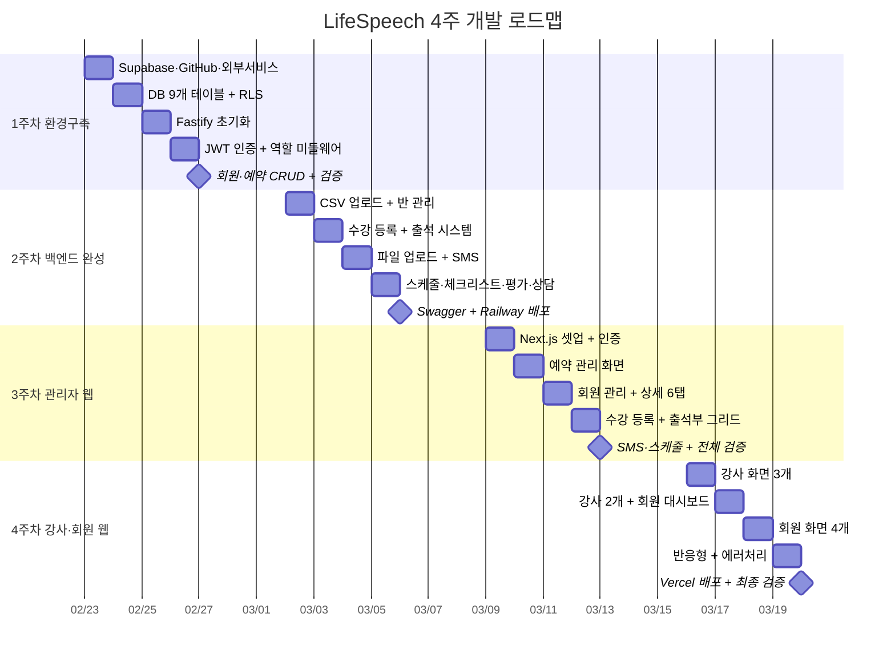

# LifeSpeech 앱 개발 플랜 · 2026년 2~3월

> **기간**: 2026-02-23 ~ 2026-03-20 (4주)
> **목표**: 백엔드 38개 API + 관리자·강사·회원 웹 완성 + Vercel 배포
> **근무**: 월·수·목·금 10:00~19:00 / 화 13:00~21:00 (🎤 스피치 수업)

---

## 📅 월별 캘린더

<table style="width:100%; border-collapse:separate; border-spacing:3px; font-family:sans-serif; font-size:13px;">

<thead>
<tr>
  <th style="background:#111827; color:white; padding:10px; text-align:center; border-radius:6px; width:14%;">월</th>
  <th style="background:#111827; color:white; padding:10px; text-align:center; border-radius:6px; width:14%;">화 🎤</th>
  <th style="background:#111827; color:white; padding:10px; text-align:center; border-radius:6px; width:14%;">수</th>
  <th style="background:#111827; color:white; padding:10px; text-align:center; border-radius:6px; width:14%;">목</th>
  <th style="background:#111827; color:white; padding:10px; text-align:center; border-radius:6px; width:14%;">금 ✅</th>
  <th style="background:#374151; color:#9CA3AF; padding:10px; text-align:center; border-radius:6px; width:14%;">토</th>
  <th style="background:#374151; color:#9CA3AF; padding:10px; text-align:center; border-radius:6px; width:14%;">일</th>
</tr>
</thead>

<tbody>

<!-- 2월 헤더 -->
<tr>
  <td colspan="7" style="background:#F9FAFB; color:#374151; padding:8px 14px; font-weight:700; font-size:14px; border-radius:6px; border-left:4px solid #6366F1;">
    📅 2026년 2월
  </td>
</tr>

<!-- 2/16 주 - 준비 기간 -->
<tr>
  <td style="padding:10px 8px; text-align:center; color:#D1D5DB; background:#F9FAFB; border-radius:6px;">16</td>
  <td style="padding:10px 8px; text-align:center; color:#D1D5DB; background:#F9FAFB; border-radius:6px;">17</td>
  <td style="padding:10px 8px; text-align:center; color:#D1D5DB; background:#F9FAFB; border-radius:6px;">18</td>
  <td style="padding:10px 8px; text-align:center; color:#D1D5DB; background:#F9FAFB; border-radius:6px;">19 2차 미팅</td>
  <td style="padding:10px 8px; text-align:center; color:#D1D5DB; background:#F9FAFB; border-radius:6px;">20</td>
  <td style="padding:10px 8px; text-align:center; color:#E5E7EB; background:#F3F4F6; border-radius:6px;">21</td>
  <td style="padding:10px 8px; text-align:center; color:#E5E7EB; background:#F3F4F6; border-radius:6px;">22 플랜작성</td>
</tr>

<!-- 1주차 헤더 배너 -->
<tr>
  <td colspan="5" style="background:#2563EB; color:white; padding:9px 16px; font-weight:700; font-size:14px; border-radius:8px 8px 0 0; letter-spacing:0.3px;">
    🔧 1주차 — 개발 환경 구축 &nbsp;·&nbsp; 2/23 ~ 2/27
  </td>
  <td colspan="2" style="background:#F3F4F6; border-radius:6px;"></td>
</tr>
<!-- 1주차 날짜 -->
<tr>
  <td style="background:#DBEAFE; padding:12px 8px; text-align:center; border-radius:0 0 0 8px; border-bottom:3px solid #2563EB;">
    
23

    
서비스 가입 GitHub 세팅

  </td>
  <td style="background:#DBEAFE; padding:12px 8px; text-align:center; border-bottom:3px solid #2563EB;">
    
24

    
DB 9개 테이블 RLS 설정

  </td>
  <td style="background:#DBEAFE; padding:12px 8px; text-align:center; border-bottom:3px solid #2563EB;">
    
25

    
Fastify 초기화

  </td>
  <td style="background:#DBEAFE; padding:12px 8px; text-align:center; border-bottom:3px solid #2563EB;">
    
26

    
JWT 인증 역할 미들웨어

  </td>
  <td style="background:#DBEAFE; padding:12px 8px; text-align:center; border-radius:0 0 8px 0; border-bottom:3px solid #2563EB;">
    
27 ✅

    
회원·예약 CRUD 검증

  </td>
  <td style="background:#F3F4F6; border-radius:6px; text-align:center; color:#D1D5DB; padding:12px 8px;">28</td>
  <td style="background:#F3F4F6; border-radius:6px;"></td>
</tr>

<!-- 3월 헤더 -->
<tr>
  <td colspan="7" style="background:#F9FAFB; color:#374151; padding:8px 14px; font-weight:700; font-size:14px; border-radius:6px; border-left:4px solid #6366F1;">
    📅 2026년 3월
  </td>
</tr>

<!-- 2주차 헤더 배너 -->
<tr>
  <td colspan="5" style="background:#059669; color:white; padding:9px 16px; font-weight:700; font-size:14px; border-radius:8px 8px 0 0; letter-spacing:0.3px;">
    🚀 2주차 — 백엔드 API 38개 완성 &nbsp;·&nbsp; 3/2 ~ 3/6
  </td>
  <td colspan="2" style="background:#F3F4F6; border-radius:6px;"></td>
</tr>
<!-- 2주차 날짜 -->
<tr>
  <td style="background:#D1FAE5; padding:12px 8px; text-align:center; border-radius:0 0 0 8px; border-bottom:3px solid #059669;">
    
2

    
CSV 업로드 반 관리 API

  </td>
  <td style="background:#D1FAE5; padding:12px 8px; text-align:center; border-bottom:3px solid #059669;">
    
3

    
수강 등록 출석 시스템

  </td>
  <td style="background:#D1FAE5; padding:12px 8px; text-align:center; border-bottom:3px solid #059669;">
    
4

    
파일 업로드 SMS API

  </td>
  <td style="background:#D1FAE5; padding:12px 8px; text-align:center; border-bottom:3px solid #059669;">
    
5

    
스케줄·체크 평가·상담

  </td>
  <td style="background:#D1FAE5; padding:12px 8px; text-align:center; border-radius:0 0 8px 0; border-bottom:3px solid #059669;">
    
6 ✅

    
Swagger Railway 배포

  </td>
  <td style="background:#F3F4F6; border-radius:6px; text-align:center; color:#D1D5DB; padding:12px 8px;">7</td>
  <td style="background:#F3F4F6; border-radius:6px; text-align:center; color:#D1D5DB; padding:12px 8px;">8</td>
</tr>

<!-- 3주차 헤더 배너 -->
<tr>
  <td colspan="5" style="background:#D97706; color:white; padding:9px 16px; font-weight:700; font-size:14px; border-radius:8px 8px 0 0; letter-spacing:0.3px;">
    🖥️ 3주차 — 관리자 웹 페이지 &nbsp;·&nbsp; 3/9 ~ 3/13
  </td>
  <td colspan="2" style="background:#F3F4F6; border-radius:6px;"></td>
</tr>
<!-- 3주차 날짜 -->
<tr>
  <td style="background:#FEF3C7; padding:12px 8px; text-align:center; border-radius:0 0 0 8px; border-bottom:3px solid #D97706;">
    
9

    
Next.js 셋업 인증·레이아웃

  </td>
  <td style="background:#FEF3C7; padding:12px 8px; text-align:center; border-bottom:3px solid #D97706;">
    
10

    
예약 관리 CSV 업로드 화면

  </td>
  <td style="background:#FEF3C7; padding:12px 8px; text-align:center; border-bottom:3px solid #D97706;">
    
11

    
회원 관리 상세 6탭

  </td>
  <td style="background:#FEF3C7; padding:12px 8px; text-align:center; border-bottom:3px solid #D97706;">
    
12

    
수강 등록 출석부 그리드

  </td>
  <td style="background:#FEF3C7; padding:12px 8px; text-align:center; border-radius:0 0 8px 0; border-bottom:3px solid #D97706;">
    
13 ✅

    
SMS·스케줄 전체 플로우 검증

  </td>
  <td style="background:#F3F4F6; border-radius:6px; text-align:center; color:#D1D5DB; padding:12px 8px;">14</td>
  <td style="background:#F3F4F6; border-radius:6px; text-align:center; color:#D1D5DB; padding:12px 8px;">15</td>
</tr>

<!-- 4주차 헤더 배너 -->
<tr>
  <td colspan="5" style="background:#DC2626; color:white; padding:9px 16px; font-weight:700; font-size:14px; border-radius:8px 8px 0 0; letter-spacing:0.3px;">
    📱 4주차 — 강사·회원 웹 + 최종 배포 &nbsp;·&nbsp; 3/16 ~ 3/20
  </td>
  <td colspan="2" style="background:#F3F4F6; border-radius:6px;"></td>
</tr>
<!-- 4주차 날짜 -->
<tr>
  <td style="background:#FEE2E2; padding:12px 8px; text-align:center; border-radius:0 0 0 8px; border-bottom:3px solid #DC2626;">
    
16

    
강사 화면 3개

  </td>
  <td style="background:#FEE2E2; padding:12px 8px; text-align:center; border-bottom:3px solid #DC2626;">
    
17

    
강사 2개 회원 대시보드

  </td>
  <td style="background:#FEE2E2; padding:12px 8px; text-align:center; border-bottom:3px solid #DC2626;">
    
18

    
회원 화면 4개

  </td>
  <td style="background:#FEE2E2; padding:12px 8px; text-align:center; border-bottom:3px solid #DC2626;">
    
19

    
반응형 에러 처리

  </td>
  <td style="background:#FEE2E2; padding:12px 8px; text-align:center; border-radius:0 0 8px 0; border-bottom:3px solid #DC2626;">
    
20 🎉

    
Vercel 배포 3역할 최종 검증

  </td>
  <td style="background:#F3F4F6; border-radius:6px; text-align:center; color:#D1D5DB; padding:12px 8px;">21</td>
  <td style="background:#F3F4F6; border-radius:6px;"></td>
</tr>

</tbody>
</table>

---

## 📊 간트차트

---

## 📋 주차별 상세 체크리스트

### 🔧 1주차 (2/23~2/27) — 개발 환경 구축

| 날짜 | 작업 | 완료 기준 |
|------|------|-----------|
| 2/23 (월) | Supabase·Railway·GitHub 가입, 환경변수 설정 | `.env` 완성, GitHub repo 생성 |
| 2/24 (화) | DB 9개 테이블 생성, RLS 정책 설정 | Supabase Table Editor에서 전체 확인 |
| 2/25 (수) | Fastify 초기화, 폴더 구조 세팅 | `npm run dev` 실행, `GET /health` 200 응답 |
| 2/26 (목) | JWT 인증 플로우, 역할별 미들웨어 | 3역할 로그인 토큰 발급 확인 |
| 2/27 (금) | 회원·예약 CRUD API + 동작 검증 | Postman 테스트 통과 ✅ |

### 🚀 2주차 (3/2~3/6) — 백엔드 API 38개 완성

| 날짜 | 작업 | 완료 기준 |
|------|------|-----------|
| 3/2 (월) | CSV 업로드 파싱, 반(클래스) 관리 API | 엑셀 → DB 저장 확인 |
| 3/3 (화) | 수강 등록 API, 출석 체크인 API | QR 코드 출석 처리 성공 |
| 3/4 (수) | Supabase Storage 파일 업로드, SMS 발송 API | 알리고 문자 발송 확인 |
| 3/5 (목) | 스케줄·강사 체크리스트·평가·상담 API | 전체 API 38개 완성 |
| 3/6 (금) | Swagger 문서 + Railway 프로덕션 배포 | 공개 URL에서 API 호출 성공 ✅ |

### 🖥️ 3주차 (3/9~3/13) — 관리자 웹 페이지

| 날짜 | 작업 | 완료 기준 |
|------|------|-----------|
| 3/9 (월) | Next.js 셋업, 로그인/레이아웃/사이드바 | 관리자 로그인 → 대시보드 이동 |
| 3/10 (화) | 예약 관리 화면, CSV 업로드 UI | 파일 선택 → 회원 등록 성공 |
| 3/11 (수) | 회원 관리 테이블, 상세 6탭 | 회원 검색·조회·편집 완료 |
| 3/12 (목) | 수강 등록 폼, 출석부 그리드 | 출석 현황 렌더링 확인 |
| 3/13 (금) | SMS 발송 UI, 스케줄 화면, 전체 플로우 검증 | 에러 없이 전체 기능 통과 ✅ |

### 📱 4주차 (3/16~3/20) — 강사·회원 웹 + 최종 배포

| 날짜 | 작업 | 완료 기준 |
|------|------|-----------|
| 3/16 (월) | 강사 대시보드, 출석 체크 화면, 스케줄 | 강사 로그인 → 출석 처리 성공 |
| 3/17 (화) | 강사 체크리스트·상담 메모, 회원 대시보드 | 회원 로그인 → 본인 데이터 표시 |
| 3/18 (수) | 회원 출석기록·숙제업로드·평가결과·일정 | 파일 업로드 → Supabase 저장 |
| 3/19 (목) | 반응형 (모바일 햄버거 메뉴), 에러 상태 통일 | 모바일 브라우저에서 주요 기능 동작 |
| 3/20 (금) | Vercel 배포, 3역할 최종 시연 | `lifespeech-admin.vercel.app` 접속 + 소장님 시연 🎉 |

---

## 🗺️ 기술 스택

| 영역 | 기술 | 배포 |
|------|------|------|
| 백엔드 | Fastify + Node.js | Railway |
| DB / Storage | Supabase (PostgreSQL + Storage) | Supabase Cloud |
| 관리자 웹 | Next.js 14 + Tailwind CSS | Vercel |
| 강사·회원 웹 | Next.js 14 + Tailwind CSS | Vercel |
| 모바일 앱 (5주차~) | Expo (React Native) | - |
