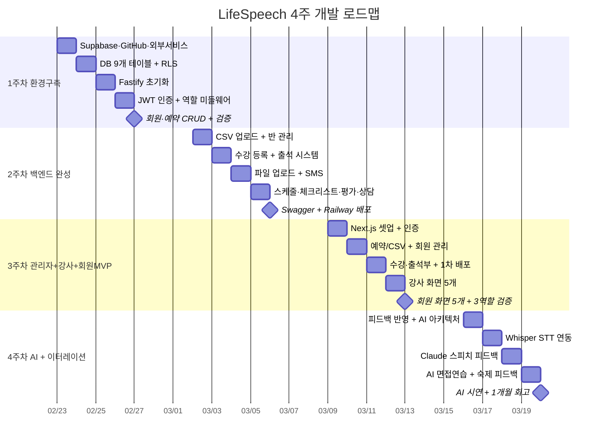

# LifeSpeech 앱 개발 플랜 · 2026년 2~3월

<table style="width:100%; border-collapse:separate; border-spacing:3px; font-family:sans-serif; font-size:13px;">

<thead>
<tr>
  <th style="background:#111827; color:white; padding:10px; text-align:center; border-radius:6px; width:14%;">월</th>
  <th style="background:#111827; color:white; padding:10px; text-align:center; border-radius:6px; width:14%;">화 🎤</th>
  <th style="background:#111827; color:white; padding:10px; text-align:center; border-radius:6px; width:14%;">수</th>
  <th style="background:#111827; color:white; padding:10px; text-align:center; border-radius:6px; width:14%;">목</th>
  <th style="background:#111827; color:white; padding:10px; text-align:center; border-radius:6px; width:14%;">금 ✅</th>
  <th style="background:#374151; color:#9CA3AF; padding:10px; text-align:center; border-radius:6px; width:14%;">토</th>
  <th style="background:#374151; color:#9CA3AF; padding:10px; text-align:center; border-radius:6px; width:14%;">일</th>
</tr>
</thead>

<tbody>

<!-- 2월 헤더 -->
<tr>
  <td colspan="7" style="background:#F9FAFB; color:#374151; padding:8px 14px; font-weight:700; font-size:14px; border-radius:6px; border-left:4px solid #6366F1;">
    📅 2026년 2월
  </td>
</tr>

<!-- 2/16 주 - 준비 기간 -->
<tr>
  <td style="padding:10px 8px; text-align:center; color:#D1D5DB; background:#F9FAFB; border-radius:6px;">16</td>
  <td style="padding:10px 8px; text-align:center; color:#D1D5DB; background:#F9FAFB; border-radius:6px;">17</td>
  <td style="padding:10px 8px; text-align:center; color:#D1D5DB; background:#F9FAFB; border-radius:6px;">18</td>
  <td style="padding:10px 8px; text-align:center; color:#D1D5DB; background:#F9FAFB; border-radius:6px;">19<br><span style="font-size:10px; color:#9CA3AF;">2차 미팅</span></td>
  <td style="padding:10px 8px; text-align:center; color:#D1D5DB; background:#F9FAFB; border-radius:6px;">20</td>
  <td style="padding:10px 8px; text-align:center; color:#E5E7EB; background:#F3F4F6; border-radius:6px;">21</td>
  <td style="padding:10px 8px; text-align:center; color:#E5E7EB; background:#F3F4F6; border-radius:6px;">22<br><span style="font-size:10px; color:#D1D5DB;">플랜작성</span></td>
</tr>

<!-- 1주차 헤더 배너 -->
<tr>
  <td colspan="5" style="background:#2563EB; color:white; padding:9px 16px; font-weight:700; font-size:14px; border-radius:8px 8px 0 0; letter-spacing:0.3px;">
    🔧 1주차 — 개발 환경 구축 &nbsp;·&nbsp; 2/23 ~ 2/27
  </td>
  <td colspan="2" style="background:#F3F4F6; border-radius:6px;"></td>
</tr>
<!-- 1주차 날짜 -->
<tr>
  <td style="background:#DBEAFE; padding:12px 8px; text-align:center; border-radius:0 0 0 8px; border-bottom:3px solid #2563EB;">
    <div style="font-weight:700; font-size:15px; color:#1E3A8A;">23</div>
    <div style="font-size:11px; color:#1D4ED8; margin-top:4px;">서비스 가입<br>GitHub 세팅</div>
  </td>
  <td style="background:#DBEAFE; padding:12px 8px; text-align:center; border-bottom:3px solid #2563EB;">
    <div style="font-weight:700; font-size:15px; color:#1E3A8A;">24</div>
    <div style="font-size:11px; color:#1D4ED8; margin-top:4px;">DB 9개 테이블<br>RLS 설정</div>
  </td>
  <td style="background:#DBEAFE; padding:12px 8px; text-align:center; border-bottom:3px solid #2563EB;">
    <div style="font-weight:700; font-size:15px; color:#1E3A8A;">25</div>
    <div style="font-size:11px; color:#1D4ED8; margin-top:4px;">Fastify<br>초기화</div>
  </td>
  <td style="background:#DBEAFE; padding:12px 8px; text-align:center; border-bottom:3px solid #2563EB;">
    <div style="font-weight:700; font-size:15px; color:#1E3A8A;">26</div>
    <div style="font-size:11px; color:#1D4ED8; margin-top:4px;">JWT 인증<br>역할 미들웨어</div>
  </td>
  <td style="background:#DBEAFE; padding:12px 8px; text-align:center; border-radius:0 0 8px 0; border-bottom:3px solid #2563EB;">
    <div style="font-weight:700; font-size:15px; color:#1E3A8A;">27 ✅</div>
    <div style="font-size:11px; color:#1D4ED8; margin-top:4px;">회원·예약<br>CRUD 검증</div>
  </td>
  <td style="background:#F3F4F6; border-radius:6px; text-align:center; color:#D1D5DB; padding:12px 8px;">28</td>
  <td style="background:#F3F4F6; border-radius:6px;"></td>
</tr>

<!-- 3월 헤더 -->
<tr>
  <td colspan="7" style="background:#F9FAFB; color:#374151; padding:8px 14px; font-weight:700; font-size:14px; border-radius:6px; border-left:4px solid #6366F1;">
    📅 2026년 3월
  </td>
</tr>

<!-- 2주차 헤더 배너 -->
<tr>
  <td colspan="5" style="background:#059669; color:white; padding:9px 16px; font-weight:700; font-size:14px; border-radius:8px 8px 0 0; letter-spacing:0.3px;">
    🚀 2주차 — 백엔드 API 38개 완성 &nbsp;·&nbsp; 3/2 ~ 3/6
  </td>
  <td colspan="2" style="background:#F3F4F6; border-radius:6px;"></td>
</tr>
<!-- 2주차 날짜 -->
<tr>
  <td style="background:#D1FAE5; padding:12px 8px; text-align:center; border-radius:0 0 0 8px; border-bottom:3px solid #059669;">
    <div style="font-weight:700; font-size:15px; color:#064E3B;">2</div>
    <div style="font-size:11px; color:#047857; margin-top:4px;">CSV 업로드<br>반 관리 API</div>
  </td>
  <td style="background:#D1FAE5; padding:12px 8px; text-align:center; border-bottom:3px solid #059669;">
    <div style="font-weight:700; font-size:15px; color:#064E3B;">3</div>
    <div style="font-size:11px; color:#047857; margin-top:4px;">수강 등록<br>출석 시스템</div>
  </td>
  <td style="background:#D1FAE5; padding:12px 8px; text-align:center; border-bottom:3px solid #059669;">
    <div style="font-weight:700; font-size:15px; color:#064E3B;">4</div>
    <div style="font-size:11px; color:#047857; margin-top:4px;">파일 업로드<br>SMS API</div>
  </td>
  <td style="background:#D1FAE5; padding:12px 8px; text-align:center; border-bottom:3px solid #059669;">
    <div style="font-weight:700; font-size:15px; color:#064E3B;">5</div>
    <div style="font-size:11px; color:#047857; margin-top:4px;">스케줄·체크<br>평가·상담</div>
  </td>
  <td style="background:#D1FAE5; padding:12px 8px; text-align:center; border-radius:0 0 8px 0; border-bottom:3px solid #059669;">
    <div style="font-weight:700; font-size:15px; color:#064E3B;">6 ✅</div>
    <div style="font-size:11px; color:#047857; margin-top:4px;">Swagger<br>Railway 배포</div>
  </td>
  <td style="background:#F3F4F6; border-radius:6px; text-align:center; color:#D1D5DB; padding:12px 8px;">7</td>
  <td style="background:#F3F4F6; border-radius:6px; text-align:center; color:#D1D5DB; padding:12px 8px;">8</td>
</tr>

<!-- 3주차 헤더 배너 -->
<tr>
  <td colspan="5" style="background:#D97706; color:white; padding:9px 16px; font-weight:700; font-size:14px; border-radius:8px 8px 0 0; letter-spacing:0.3px;">
    🖥️ 3주차 — 관리자+강사+회원 웹 MVP + 1차 배포 &nbsp;·&nbsp; 3/9 ~ 3/13
  </td>
  <td colspan="2" style="background:#F3F4F6; border-radius:6px;"></td>
</tr>
<!-- 3주차 날짜 -->
<tr>
  <td style="background:#FEF3C7; padding:12px 8px; text-align:center; border-radius:0 0 0 8px; border-bottom:3px solid #D97706;">
    <div style="font-weight:700; font-size:15px; color:#78350F;">9</div>
    <div style="font-size:11px; color:#B45309; margin-top:4px;">Next.js 셋업<br>인증·레이아웃</div>
  </td>
  <td style="background:#FEF3C7; padding:12px 8px; text-align:center; border-bottom:3px solid #D97706;">
    <div style="font-weight:700; font-size:15px; color:#78350F;">10</div>
    <div style="font-size:11px; color:#B45309; margin-top:4px;">예약/CSV<br>회원 관리</div>
  </td>
  <td style="background:#FEF3C7; padding:12px 8px; text-align:center; border-bottom:3px solid #D97706;">
    <div style="font-weight:700; font-size:15px; color:#78350F;">11 🚀</div>
    <div style="font-size:11px; color:#B45309; margin-top:4px;">수강·출석부<br>1차 배포!</div>
  </td>
  <td style="background:#FEF3C7; padding:12px 8px; text-align:center; border-bottom:3px solid #D97706;">
    <div style="font-weight:700; font-size:15px; color:#78350F;">12</div>
    <div style="font-size:11px; color:#B45309; margin-top:4px;">강사 화면<br>5개</div>
  </td>
  <td style="background:#FEF3C7; padding:12px 8px; text-align:center; border-radius:0 0 8px 0; border-bottom:3px solid #D97706;">
    <div style="font-weight:700; font-size:15px; color:#78350F;">13 ✅</div>
    <div style="font-size:11px; color:#B45309; margin-top:4px;">회원 화면 5개<br>3역할 검증</div>
  </td>
  <td style="background:#F3F4F6; border-radius:6px; text-align:center; color:#D1D5DB; padding:12px 8px;">14</td>
  <td style="background:#F3F4F6; border-radius:6px; text-align:center; color:#D1D5DB; padding:12px 8px;">15</td>
</tr>

<!-- 4주차 헤더 배너 -->
<tr>
  <td colspan="5" style="background:#DC2626; color:white; padding:9px 16px; font-weight:700; font-size:14px; border-radius:8px 8px 0 0; letter-spacing:0.3px;">
    🤖 4주차 — AI 기능 + 소장님 이터레이션 &nbsp;·&nbsp; 3/16 ~ 3/20
  </td>
  <td colspan="2" style="background:#F3F4F6; border-radius:6px;"></td>
</tr>
<!-- 4주차 날짜 -->
<tr>
  <td style="background:#EDE9FE; padding:12px 8px; text-align:center; border-radius:0 0 0 8px; border-bottom:3px solid #7C3AED;">
    <div style="font-weight:700; font-size:15px; color:#3B0764;">16</div>
    <div style="font-size:11px; color:#6D28D9; margin-top:4px;">피드백 반영<br>AI 설계</div>
  </td>
  <td style="background:#EDE9FE; padding:12px 8px; text-align:center; border-bottom:3px solid #7C3AED;">
    <div style="font-weight:700; font-size:15px; color:#3B0764;">17</div>
    <div style="font-size:11px; color:#6D28D9; margin-top:4px;">Whisper<br>음성→텍스트</div>
  </td>
  <td style="background:#EDE9FE; padding:12px 8px; text-align:center; border-bottom:3px solid #7C3AED;">
    <div style="font-weight:700; font-size:15px; color:#3B0764;">18</div>
    <div style="font-size:11px; color:#6D28D9; margin-top:4px;">Claude<br>스피치 분석</div>
  </td>
  <td style="background:#EDE9FE; padding:12px 8px; text-align:center; border-bottom:3px solid #7C3AED;">
    <div style="font-weight:700; font-size:15px; color:#3B0764;">19</div>
    <div style="font-size:11px; color:#6D28D9; margin-top:4px;">AI 면접연습<br>숙제 피드백</div>
  </td>
  <td style="background:#EDE9FE; padding:12px 8px; text-align:center; border-radius:0 0 8px 0; border-bottom:3px solid #7C3AED;">
    <div style="font-weight:700; font-size:15px; color:#3B0764;">20 🎉</div>
    <div style="font-size:11px; color:#6D28D9; margin-top:4px;">AI 시연<br>1개월 회고</div>
  </td>
  <td style="background:#F3F4F6; border-radius:6px; text-align:center; color:#D1D5DB; padding:12px 8px;">21</td>
  <td style="background:#F3F4F6; border-radius:6px;"></td>
</tr>

</tbody>
</table>

---

## 📊 간트차트



---

## ✅ 이번 주 할 일

```dataview
TASK
FROM "10. Planner"
WHERE !completed
AND file.day >= date(today)
AND file.day <= date(today) + dur(7 days)
SORT file.day ASC
```
